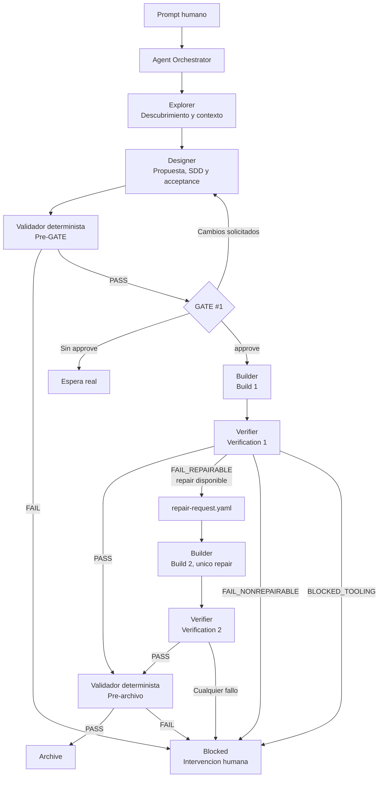
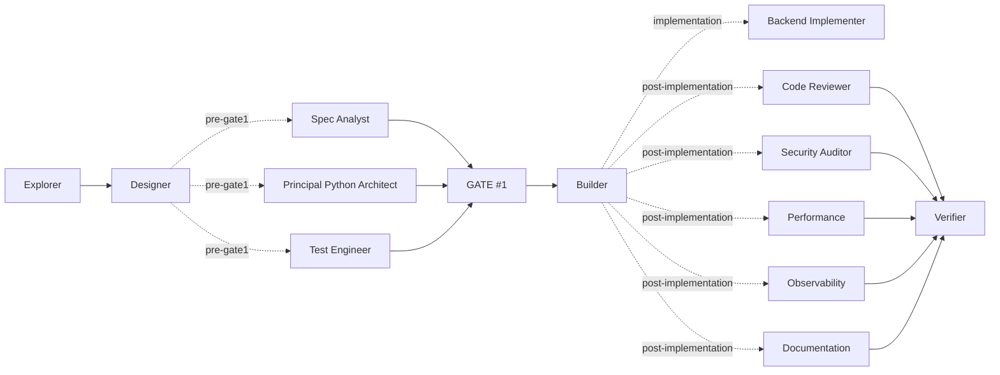

# Referencia completa del AI Agent Harness

> Snapshot tecnico del bundle `simple` version `0.4.0`.
>
> Este documento consolida la arquitectura, las mejoras, los contratos, los
> agentes, las skills, los artefactos, el flujo y el codigo del validador.
> Las fuentes ejecutables dentro de `.codex/` siguen siendo canonicas si en el
> futuro difieren de este snapshot.

## 1. Resumen ejecutivo

Este harness es una base general, portable y nativa de Codex para desarrollar
features pequenas o medianas mediante SDD sin construir un framework complejo.
La sesion principal actua como `Agent Orchestrator`; las fases de trabajo se
delegan a subagentes runtime con contexto limpio y los resultados persistentes
se guardan como Markdown, YAML, JSON y TOML.

El flujo base combina cuatro patrones:

1. **Pipeline:** `Explorer -> Designer -> Builder -> Verifier`.
2. **Router:** el orquestador decide la siguiente transicion usando un contrato
   y un veredicto estructurado.
3. **Evaluador-optimizador acotado:** Verifier puede devolver el trabajo a
   Builder una vez, nunca indefinidamente.
4. **Maquina de estados:** `workflow.toml` define fases, eventos, actores y
   guards validos.

La IA conserva la responsabilidad semantica; el validador determinista protege
la estructura, los invariantes y las condiciones de cierre. El humano mantiene
la autoridad sobre `GATE#1` y sobre cualquier fallo que no sea reparable dentro
del alcance aprobado.

## 2. Paquete minimo portable

Para instalar el harness en otro repositorio solo son imprescindibles:

```text
<repo>/
├── .codex/
├── AGENTS.md
└── HARNESS.md
```

- `.codex/` contiene configuracion, contratos, agentes, skills, plantillas,
  estado, tests y validador.
- `AGENTS.md` es la entrada de instrucciones que Codex descubre y aplica.
- `HARNESS.md` explica la operacion completa y es lectura obligatoria por
  mandato de `AGENTS.md`.

`USAGE.md`, `FAST-USAGE.md`, `INSTRUCCIONES.md`, `AGENTS.example.md` y
`examples/` son ayuda adicional, no dependencias del runtime.

## 3. Objetivos y limites de arquitectura

### Objetivos

- Mantener contexto de cada agente pequeno, especializado y reemplazable.
- Persistir conocimiento fuera de la ventana de contexto.
- Hacer verificable la salida de la IA mediante comandos y evidencias.
- Poder interrumpir y reanudar una feature sin reconstruir toda la conversacion.
- Conservar trazabilidad de modelo, esfuerzo, runtime, artefactos y decisiones.
- Ser una base general que pueda especializarse para backend u otros dominios.

### Limites deliberados

- Un solo orquestador.
- Un solo gate humano obligatorio.
- Un solo repair automatico.
- Sin base de datos de memoria ni vector store.
- Sin motor externo de grafos.
- Sin router de modelos adicional.
- Sin bucles abiertos de autoevaluacion.
- Sin revisores paralelos obligatorios.
- Sin dependencias Python externas para validar el harness.

Estas ausencias son decisiones de simplicidad, no carencias accidentales. Se
deben revisar solo cuando exista una necesidad observada y medible.

## 4. Estructura del bundle

```text
.codex/
├── agents/                     # Contratos TOML de agentes
│   ├── agent-orchestrator.toml
│   ├── explorer.toml
│   ├── designer.toml
│   ├── builder.toml
│   ├── verifier.toml
│   ├── ...especialistas...
│   └── sample-agent.toml       # Plantilla, no ejecutable
├── contracts/
│   └── workflow.toml           # Maquina de estados canonica
├── progress/
│   └── <feature-id>/           # Memoria persistente por feature
├── skills/
│   └── <skill>/SKILL.md
├── templates/                  # Esquemas operativos versionados
├── tests/
│   └── test_validate_harness.py
├── tools/
│   └── validate_harness.py
├── agent-registry.yaml         # Indice y politica de ejecucion
├── feature_list.json           # Cola de features
├── config.toml                 # Configuracion nativa de Codex
├── harness.toml                # Configuracion interna del bundle
├── CHANGELOG.md
└── README.md
```

## 5. Todas las mejoras incorporadas

### 5.1 Validador determinista

Se creo `.codex/tools/validate_harness.py`. Usa exclusivamente la biblioteca
estandar de Python y valida tanto el bundle como una feature concreta.

Comprueba:

- presencia de archivos core;
- sintaxis TOML y JSON;
- clave canonica de concurrencia;
- coherencia de fases terminales;
- conjunto exacto de veredictos;
- validez y unicidad de transiciones;
- presupuesto de un repair;
- rutas y campos de contratos de agentes;
- modelo y esfuerzo de los agentes base;
- frontmatter y nombres duplicados de skills;
- version del bundle frente al changelog;
- IDs, estados y fases del feature list;
- existencia de estado por feature;
- gates obligatorios;
- IDs runtime reales;
- esquema ejecutable de acceptance;
- guard de archivo con `PASS` y `archive.md`.

El validador se ejecuta antes de abrir `GATE#1` y antes de archivar. Un error
bloquea la transicion.

### 5.2 Contrato formal de workflow

Se creo `.codex/contracts/workflow.toml` como fuente canonica de fases,
eventos, actores, guards, estados terminales y presupuesto de repair. Esto
evita inferir el flujo desde prosa libre.

### 5.3 Veredictos estructurados

Verifier solo puede emitir:

- `PASS`
- `FAIL_REPAIRABLE`
- `FAIL_NONREPAIRABLE`
- `BLOCKED_TOOLING`

El orquestador consume `verification-result.yaml`; no decide mediante frases
como "parece correcto" o "esta casi verde".

### 5.4 Repair automatico limitado

Un primer `FAIL_REPAIRABLE` puede producir `repair-request.yaml` y volver a
Builder. El segundo build debe conservar propuesta, diseno y acceptance. Tras
la segunda verificacion, cualquier fallo requiere intervencion humana.

Condiciones para declarar un fallo reparable:

- el fallo es reproducible;
- esta dentro del scope aprobado;
- no exige cambiar design;
- no exige cambiar acceptance;
- no repite efectos irreversibles;
- queda presupuesto de repair.

### 5.5 Acceptance ejecutable

`SDD/acceptance.yaml` usa `version: 1`. Cada criterio contiene identidad,
resultado verificable, obligatoriedad, evidencia y estado.

- `kind: command`: comando no interactivo, directorio, timeout y exit code.
- `kind: file`: ruta y resultado esperado.
- `kind: inspection`: procedimiento reproducible y resultado esperado.

Un criterio ambiguo o incompleto bloquea `GATE#1`.

### 5.6 Guard de archivo

Una feature solo puede quedar `archived` cuando:

- existe `archive.md`;
- `verification-result.yaml` declara `PASS`;
- todos los checks obligatorios han pasado;
- existe runtime verificable de Verifier;
- el validador determinista no encuentra errores.

### 5.7 Trazabilidad de intentos

`state.yaml` registra intentos de build, verificacion y repair, limite de
repairs, ultimo veredicto y estado de los artefactos. Esto elimina la
ambiguedad al reanudar una ejecucion interrumpida.

### 5.8 Contratos de agentes reforzados

- Designer produce criterios ejecutables y valida antes del gate.
- Test Engineer comprueba procedimientos y evidencias.
- Builder conoce build `1` o `2` y consume `repair-request.yaml`.
- Verifier genera un resultado estructurado y no corrige codigo.
- Agent Orchestrator aplica la maquina de estados y limita el repair.

### 5.9 Registro runtime real

Cada subagente lanzado registra ID runtime, padre, modelo, esfuerzo, fase,
tiempos, estado, inputs y outputs. No se permite cerrar una fase con
`logical-only`, con un ID vacio o con sustitucion silenciosa del modelo.

### 5.10 Tests del validador

Se incorporaron cuatro tests unitarios con `unittest`:

1. el bundle actual no contiene errores;
2. una feature archivada requiere `PASS`;
3. un acceptance de comando requiere campos ejecutables;
4. el frontmatter acepta UTF-8 BOM.

### 5.11 Skills generales nuevas

Se añadieron `harness-doctor`, `feature-resume`, `project-bootstrap`,
`systematic-debugging`, `verification-before-completion` y
`eval-driven-development`. No se elimino ninguna skill existente.

### 5.12 Configuracion de concurrencia actualizada

Se reemplazo la clave antigua por:

```toml
[agents]
max_concurrent_threads_per_session = 6
max_depth = 1
```

### 5.13 Documentacion sincronizada

Se alinearon `AGENTS.md`, `HARNESS.md`, `USAGE.md`, `INSTRUCCIONES.md`,
`.codex/README.md` y `.codex/CHANGELOG.md` con el mismo flujo y vocabulario.

### 5.14 Limpieza para uso como plantilla

- se retiro el workspace historico `HARNESS-001`;
- se elimino su entrada del feature list;
- se eliminaron carpetas temporales y documentos de auditoria residuales;
- se mantuvo `SAMPLE-001` como ejemplo inicial;
- `.gitignore` excluye `tmp*/`, `__pycache__/` y `.pytest_cache/`.

## 6. Diagrama completo del flujo



### Flujo opcional de especialistas



Los especialistas no son obligatorios. El humano los solicita o el plan los
declara explicitamente. Si el punto de insercion no es claro, el orquestador
pregunta antes de continuar.

## 7. Maquina de estados

| Fase | Proposito | Actor que permite avanzar |
| --- | --- | --- |
| `intake` | Registrar tarea y crear workspace | Agent Orchestrator |
| `exploration` | Mapear repo y restricciones | Explorer / Orchestrator |
| `design` | Propuesta, SDD y acceptance | Designer / Orchestrator |
| `gate1_pending` | Esperar decision humana | Humano |
| `implementation` | Construir o reparar | Builder / Orchestrator |
| `verification` | Ejecutar checks y emitir veredicto | Verifier / Orchestrator |
| `archived` | Cierre exitoso | Orchestrator con `PASS` |
| `blocked` | Requiere ayuda o tooling | Humano |
| `cancelled` | Trabajo cancelado | Humano / Orchestrator |

### Transiciones

| Desde | Evento | Hacia | Actor | Guards principales |
| --- | --- | --- | --- | --- |
| `intake` | `start_exploration` | `exploration` | Orchestrator | feature y lock |
| `exploration` | `exploration_complete` | `design` | Orchestrator | runtime y artefactos |
| `design` | `design_complete` | `gate1_pending` | Orchestrator | runtime y SDD valido |
| `gate1_pending` | `approved` | `implementation` | Humano | gate aprobado |
| `gate1_pending` | `changes_requested` | `design` | Humano | feedback registrado |
| `implementation` | `build_complete` | `verification` | Orchestrator | runtime y reporte |
| `verification` | `pass` | `archived` | Orchestrator | PASS, checks y runtime |
| `verification` | `repairable_failure` | `implementation` | Orchestrator | repair disponible y scope estable |
| `verification` | `human_required` | `blocked` | Orchestrator | fallo o presupuesto agotado |

## 8. Contrato canonico de workflow

Ruta: `.codex/contracts/workflow.toml`.

```toml
version = 1

[workflow]
phases = [
  "intake",
  "exploration",
  "design",
  "gate1_pending",
  "implementation",
  "verification",
  "archived",
  "blocked",
  "cancelled",
]
terminal_phases = ["archived", "blocked", "cancelled"]
max_repair_attempts = 1

[verdicts]
pass = "PASS"
repairable = "FAIL_REPAIRABLE"
nonrepairable = "FAIL_NONREPAIRABLE"
tooling_blocked = "BLOCKED_TOOLING"

[[transitions]]
from = "intake"
event = "start_exploration"
to = "exploration"
actor = "agent-orchestrator"
guards = ["feature_registered", "lock_active"]

[[transitions]]
from = "exploration"
event = "exploration_complete"
to = "design"
actor = "agent-orchestrator"
guards = ["explorer_runtime_recorded", "exploration_artifacts_present"]

[[transitions]]
from = "design"
event = "design_complete"
to = "gate1_pending"
actor = "agent-orchestrator"
guards = ["designer_runtime_recorded", "sdd_valid"]

[[transitions]]
from = "gate1_pending"
event = "approved"
to = "implementation"
actor = "human"
guards = ["gate1_approved"]

[[transitions]]
from = "gate1_pending"
event = "changes_requested"
to = "design"
actor = "human"
guards = ["feedback_recorded"]

[[transitions]]
from = "implementation"
event = "build_complete"
to = "verification"
actor = "agent-orchestrator"
guards = ["builder_runtime_recorded", "implementation_artifact_present"]

[[transitions]]
from = "verification"
event = "pass"
to = "archived"
actor = "agent-orchestrator"
guards = ["verdict_pass", "all_required_checks_passed", "verifier_runtime_recorded"]

[[transitions]]
from = "verification"
event = "repairable_failure"
to = "implementation"
actor = "agent-orchestrator"
guards = [
  "verdict_fail_repairable",
  "repair_attempts_remaining",
  "scope_unchanged",
  "acceptance_unchanged",
  "no_irreversible_side_effect",
]

[[transitions]]
from = "verification"
event = "human_required"
to = "blocked"
actor = "agent-orchestrator"
guards = ["verdict_not_pass_or_repair_budget_exhausted"]
```

## 9. Contratos de agentes

### 9.1 Campos comunes

Cada contrato TOML declara:

- `name`: nombre runtime;
- `description`: responsabilidad resumida;
- `model`: modelo obligatorio cuando aplica;
- `model_reasoning_effort`: esfuerzo efectivo;
- `sandbox_mode`: permisos esperados;
- `developer_instructions`: inputs, procedimiento, output, parada y
  anti-patterns.

El registro `.codex/agent-registry.yaml` añade ID funcional, ruta, dominio,
fase, modo de ejecucion, obligatoriedad de runtime, artefactos y puntos de
insercion.

### 9.2 Agentes base

| Agente | Modelo / esfuerzo | Responsabilidad | Outputs | Limite clave |
| --- | --- | --- | --- | --- |
| Agent Orchestrator | hereda / `high` | Estado, secuencia, locks, gates y routing | plan, estado, eventos, runtimes, lock, gate | No implementa producto |
| Explorer | `gpt-5.6-terra` / `medium` | Descubrimiento verificable | `exploration.md`, `context.md`, `sources.md` | No diseña ni implementa |
| Designer | `gpt-5.6-sol` / `high` | Propuesta, requisitos, diseño, tareas y acceptance | bundle SDD previo al gate | No implementa ni deja criterios ambiguos |
| Builder | `gpt-5.6-terra` / `medium` | Implementacion aprobada o repair acotado | codigo, tests, `implementation.md` | No amplia scope ni ejecuta tercer build |
| Verifier | `gpt-5.6-terra` / `medium` | Evidencia final, veredicto y archivo | verificacion, resultado, repair o archive | No corrige codigo ni archiva sin PASS |

### 9.3 Contrato operativo del orquestador

El orquestador:

1. crea o reutiliza la feature;
2. adquiere lock por feature;
3. actualiza estado antes y despues de cada fase;
4. resuelve cada agente desde el registro;
5. respeta modelo y esfuerzo del TOML;
6. registra cada runtime y sus artefactos;
7. mantiene `events.log` append-only;
8. ejecuta Explorer y Designer;
9. valida y se detiene en `GATE#1`;
10. tras `approve`, ejecuta Builder y Verifier;
11. consume exclusivamente el veredicto estructurado;
12. permite como maximo un repair;
13. valida antes del archivo;
14. libera el lock al archivar, bloquear o cancelar.

Debe parar si falta un runtime real, hay un lock ajeno, el gate no esta
aprobado, los artefactos contradicen el estado, una configuracion de modelo no
es soportada o el validador devuelve errores.

### 9.4 Agentes especializados opcionales

| ID | Funcion | Insercion recomendada | Artefacto |
| --- | --- | --- | --- |
| `software/spec-analyst` | Convertir ambiguedad en requisitos medibles | `pre-gate1`, `sdd-requirements` | `spec-analysis.md` |
| `software/principal-python-architect` | Revisar boundaries y arquitectura Python | `pre-gate1` | `architecture-review.md` |
| `software/backend-implementer` | Implementacion backend especializada | `pre-implementation`, `implementation` | `implementation.md` |
| `software/test-engineer` | Diseñar estrategia de prueba | `pre-gate1` | seccion de `SDD/design.md` |
| `software/code-reviewer` | Revisar codigo contra SDD | `post-implementation` | `code-review.md` |
| `cross-cutting/security-auditor` | Revisar superficie de seguridad | `post-implementation` | `security-audit.md` |
| `software/performance-agent` | Revisar rendimiento y volumen | `post-implementation`, `post-verification` | `performance-review.md` |
| `software/observability-reliability` | Revisar trazabilidad y resiliencia | `sdd-design`, `post-implementation` | `observability-review.md` |
| `software/documentation-agent` | Sincronizar documentacion y codigo | `post-implementation` | `documentation-update.md` |
| `software/devex-tooling` | Revisar tooling y experiencia de desarrollo | `sdd-design`, `pre-implementation` | `devex-review.md` |
| `software/refactoring-agent` | Refactor seguro, acotado y sin cambio funcional | `pre-implementation` | `refactor.md` |

`sample-agent.toml` esta deshabilitado, no aparece en el registro y solo sirve
como plantilla para nuevos contratos.

## 10. Artefactos por feature

Cada feature usa `.codex/progress/<feature-id>/` como memoria persistente.

### 10.1 Arbol esperado

```text
.codex/progress/<feature-id>/
├── state.yaml
├── orchestration.lock.yaml
├── orchestration-plan.md
├── events.log
├── runtime-agents.yaml
├── gates/
│   └── gate1.yaml
├── exploration.md
├── proposal.md
├── SDD/
│   ├── context.md
│   ├── requirements.md
│   ├── design.md
│   ├── tasks.md
│   ├── acceptance.yaml
│   └── sources.md
├── implementation.md
├── verification.md
├── verification-result.yaml
├── repair-request.yaml          # Solo si FAIL_REPAIRABLE
├── archive.md                   # Solo si PASS
└── follow-ups.generated.yaml    # Solo si hay follow-ups
```

### 10.2 Ownership

| Artefacto | Owner | Consumidor principal |
| --- | --- | --- |
| `orchestration-plan.md` | Orchestrator | humano y todos los agentes |
| `state.yaml` | Orchestrator | reanudacion y validador |
| `orchestration.lock.yaml` | Orchestrator | otras ejecuciones |
| `events.log` | Orchestrator | auditoria y reanudacion |
| `runtime-agents.yaml` | Orchestrator | validador y auditoria |
| `gates/gate1.yaml` | Orchestrator / humano | transicion a Builder |
| `exploration.md` | Explorer | Designer |
| `SDD/context.md` | Explorer | Designer y Builder |
| `SDD/sources.md` | Explorer | trazabilidad |
| `proposal.md` | Designer | humano, Builder y Verifier |
| `SDD/requirements.md` | Designer | humano y Verifier |
| `SDD/design.md` | Designer | Builder y Verifier |
| `SDD/tasks.md` | Designer | Builder |
| `SDD/acceptance.yaml` | Designer | Builder, Verifier y validador |
| `implementation.md` | Builder | Verifier |
| `verification.md` | Verifier | humano y archivo |
| `verification-result.yaml` | Verifier | Orchestrator |
| `repair-request.yaml` | Verifier | Builder build 2 |
| `archive.md` | Verifier | cierre y auditoria |
| `follow-ups.generated.yaml` | Verifier | feature list |

## 11. Plantillas y esquemas

### 11.1 Acceptance

```yaml
version: 1
feature_id: <FEATURE-ID>
checks:
  - id: AC-001
    title: <short-verifiable-outcome>
    kind: command
    required: true
    command: <safe-non-interactive-command>
    cwd: .
    timeout_seconds: 120
    expected_exit_code: 0
    evidence: command_output
    status: pending
```

Estados validos: `pending`, `pass`, `fail`, `skipped`. `required` debe ser
booleano. IDs duplicados o tipos desconocidos son errores.

### 11.2 Resultado de verificacion

```yaml
version: 1
feature_id: <FEATURE-ID>
build_attempt: 1
verification_attempt: 1
verdict: PENDING
checks: []
repairability:
  reproducible: false
  in_approved_scope: false
  acceptance_unchanged: false
  design_unchanged: false
  no_irreversible_side_effect: false
  repair_attempts_remaining: 1
failure_summary: null
next_action: null
```

### 11.3 Repair request

```yaml
version: 1
feature_id: <FEATURE-ID>
build_attempt: 2
source_verification_attempt: 1
failing_checks: []
failure_summary: <minimal-reproducible-failure>
allowed_scope: <approved-scope-only>
acceptance_must_remain_unchanged: true
```

### 11.4 Estado de feature

```yaml
feature_id: <FEATURE-ID>
title: <FEATURE-TITLE>
status: proposed
phase: intake
last_agent: null
next_agent: agent-orchestrator
awaiting_human: false
human_gate: null
human_action_required: null
lock_file: orchestration.lock.yaml
active_lock: false
attempts:
  build: 0
  verification: 0
  repair: 0
  max_repairs: 1
last_verdict: null
artifacts:
  exploration: pending
  proposal: pending
  sdd:
    context: pending
    requirements: pending
    design: pending
    tasks: pending
    acceptance: pending
    sources: pending
  implementation: pending
  verification: pending
  verification_result: pending
  repair_request: not_needed
  archive: pending
resume_hint: Start from Agent Orchestrator
updated_at: null
```

### 11.5 Registro de runtimes

```yaml
feature_id: <FEATURE-ID>
agents:
  - agent: <AGENT-ID>
    runtime_agent_id: <RUNTIME-AGENT-ID>
    parent_agent_id: <PARENT-AGENT-ID>
    model: <EFFECTIVE-MODEL>
    model_reasoning_effort: <EFFECTIVE-EFFORT>
    phase: <PHASE>
    started_at: null
    finished_at: null
    status: running
    input_artifacts: []
    output_artifacts: []
```

### 11.6 Gate humano

```yaml
gate: GATE#1
status: pending
phase: gate1_pending
requested_by: agent-orchestrator
review_files: []
instructions_for_human:
  - Review the listed files
  - Reply with approve or concrete change requests
decision:
  response: null
  decided_by: null
  decided_at: null
notes: null
```

### 11.7 Lock por feature

```yaml
feature_id: <FEATURE-ID>
status: locked
owner_agent: agent-orchestrator
phase: intake
created_at: null
updated_at: null
thread_hint: null
stale_after_minutes: 120
recovery_notes: If this lock is stale, a human must confirm recovery before reuse.
```

## 12. Catalogo completo de skills

| Skill | Cuando se activa | Resultado | Limite principal |
| --- | --- | --- | --- |
| `backend-feature-kickoff` | Arranque de feature backend Python ambigua | resumen, riesgos, dudas y siguiente agente | no diseña ni implementa |
| `caveman` | El usuario pide comunicacion comprimida | respuestas breves con precision tecnica | no comprime si crea riesgo o ambiguedad |
| `eval-driven-development` | Medir calidad o regresiones de IA | dataset, baseline, rubrica y resultados por caso | no sustituye tests deterministas |
| `feature-resume` | Reanudar o recuperar una feature | fase real, lock, gate, intentos y siguiente paso | no inventa aprobaciones ni repairs |
| `harness-doctor` | Auditar, validar o reparar el harness | PASS/FAIL, errores y correccion minima | no declara sano por inspeccion visual |
| `plugin-eval` | Evaluar una skill o plugin local | analisis, benchmark y siguiente mejora | distingue estimacion de medida real |
| `ponytail` | Cualquier tarea de codigo o peticion YAGNI | solucion minima que funciona | no elimina validacion, seguridad ni checks |
| `project-bootstrap` | Copiar o adaptar el harness a un repo | harness instalado y reglas locales | no copia estado operativo ni inventa comandos |
| `sdd-feature-planning` | Preparar una feature hasta GATE#1 | contexto, requisitos, diseño, tareas y acceptance | no implementa ni aprueba el gate |
| `skill-creator` | Crear o mejorar skills | SKILL.md, casos de prueba y ciclo de mejora | evita skills sin trigger y salida definidos |
| `systematic-debugging` | Investigar bugs o tests rotos | reproduccion, causa raiz, fix y regresion | no corrige una causa no demostrada |
| `verification-before-completion` | Antes de decir terminado o PASS | evidencia reciente y veredicto | no sustituye checks fallidos por confianza |

Todas las skills viven en `.codex/skills/<nombre>/SKILL.md`. El bundle no
requiere recursos auxiliares para las seis skills generales nuevas.

## 13. Codigo completo del validador determinista

Ruta canonica: `.codex/tools/validate_harness.py`.

```python
#!/usr/bin/env python3
"""Deterministic validation for the portable Codex harness."""

from __future__ import annotations

import argparse
import json
import re
import sys
import tomllib
from dataclasses import asdict, dataclass
from pathlib import Path


@dataclass(frozen=True)
class Issue:
    severity: str
    code: str
    path: str
    message: str


def _issue(issues: list[Issue], severity: str, code: str, path: Path, message: str) -> None:
    issues.append(Issue(severity, code, path.as_posix(), message))


def _toml(path: Path, issues: list[Issue]) -> dict:
    try:
        return tomllib.loads(path.read_text(encoding="utf-8-sig"))
    except (OSError, tomllib.TOMLDecodeError) as exc:
        _issue(issues, "error", "invalid_toml", path, str(exc))
        return {}


def _top_yaml_scalars(path: Path) -> dict[str, str]:
    values: dict[str, str] = {}
    for line in path.read_text(encoding="utf-8-sig").splitlines():
        if line.startswith((" ", "\t", "#")) or ":" not in line:
            continue
        key, value = line.split(":", 1)
        values[key.strip()] = value.strip().strip("'\"")
    return values


def _registry_entries(path: Path, issues: list[Issue]) -> list[dict[str, str]]:
    entries: list[dict[str, str]] = []
    current: dict[str, str] | None = None
    try:
        lines = path.read_text(encoding="utf-8-sig").splitlines()
    except OSError as exc:
        _issue(issues, "error", "unreadable_registry", path, str(exc))
        return entries
    for line in lines:
        match_id = re.match(r"^  - id:\s*(.+?)\s*$", line)
        if match_id:
            current = {"id": match_id.group(1).strip("'\"")}
            entries.append(current)
            continue
        match_path = re.match(r"^    path:\s*(.+?)\s*$", line)
        if current is not None and match_path:
            current["path"] = match_path.group(1).strip("'\"")
    return entries


def _skill_metadata(path: Path) -> dict[str, str]:
    text = path.read_text(encoding="utf-8-sig")
    if not text.startswith("---\n") and not text.startswith("---\r\n"):
        return {}
    parts = re.split(r"^---\s*$", text, maxsplit=2, flags=re.MULTILINE)
    if len(parts) < 3:
        return {}
    metadata: dict[str, str] = {}
    for line in parts[1].splitlines():
        match = re.match(r"^([A-Za-z0-9_-]+):\s*(.*)$", line)
        if match:
            metadata[match.group(1)] = match.group(2).strip().strip("'\"")
    return metadata


def _acceptance_checks(path: Path) -> list[dict[str, str]]:
    checks: list[dict[str, str]] = []
    current: dict[str, str] | None = None
    for line in path.read_text(encoding="utf-8-sig").splitlines():
        start = re.match(r"^\s{2}- id:\s*(.+?)\s*$", line)
        if start:
            current = {"id": start.group(1).strip("'\"")}
            checks.append(current)
            continue
        field = re.match(r"^\s{4}([A-Za-z0-9_]+):\s*(.*?)\s*$", line)
        if current is not None and field:
            current[field.group(1)] = field.group(2).strip("'\"")
    return checks


def _validate_acceptance_records(checks: list[dict[str, str]], path: Path, issues: list[Issue]) -> None:
    if not checks:
        _issue(issues, "error", "acceptance_empty", path, "At least one check is required")
        return
    seen: set[str] = set()
    common = {"id", "title", "kind", "required", "evidence", "status"}
    per_kind = {
        "command": {"command", "cwd", "timeout_seconds", "expected_exit_code"},
        "file": {"path", "expected"},
        "inspection": {"procedure", "expected"},
    }
    for check in checks:
        check_id = check.get("id", "<missing>")
        missing = common - check.keys()
        if missing:
            _issue(issues, "error", "acceptance_fields", path, f"{check_id} missing {sorted(missing)}")
        if check_id in seen:
            _issue(issues, "error", "acceptance_duplicate_id", path, check_id)
        seen.add(check_id)
        if check.get("required") not in {"true", "false"}:
            _issue(issues, "error", "acceptance_required", path, f"{check_id} required must be true or false")
        if check.get("status") not in {"pending", "pass", "fail", "skipped"}:
            _issue(issues, "error", "acceptance_status", path, f"{check_id} has invalid status")
        kind = check.get("kind")
        if kind not in per_kind:
            _issue(issues, "error", "acceptance_kind", path, f"{check_id} has unsupported kind {kind!r}")
            continue
        missing_kind = per_kind[kind] - check.keys()
        if missing_kind:
            _issue(issues, "error", "acceptance_executable", path, f"{check_id} missing {sorted(missing_kind)}")


def _validate_acceptance(path: Path, issues: list[Issue]) -> None:
    text = path.read_text(encoding="utf-8-sig")
    if not re.search(r"^version:\s*1\s*$", text, re.MULTILINE):
        _issue(issues, "error", "acceptance_version", path, "Expected version: 1")
    _validate_acceptance_records(_acceptance_checks(path), path, issues)


def _archive_guard(phase: str | None, archive_exists: bool, verdict: str | None) -> bool:
    return phase != "archived" or (archive_exists and verdict == "PASS")


def validate(root: Path, feature: str | None = None) -> list[Issue]:
    root = root.resolve()
    codex = root / ".codex"
    issues: list[Issue] = []
    required = [
        root / "HARNESS.md",
        root / "AGENTS.md",
        codex / "config.toml",
        codex / "harness.toml",
        codex / "agent-registry.yaml",
        codex / "feature_list.json",
        codex / "contracts" / "workflow.toml",
        codex / "templates" / "acceptance.yaml",
        codex / "templates" / "verification-result.yaml",
        codex / "templates" / "repair-request.yaml",
        codex / "templates" / "runtime-agents.yaml",
    ]
    for path in required:
        if not path.is_file():
            _issue(issues, "error", "missing_file", path, "Required harness file is missing")
    if any(not path.is_file() for path in required):
        return issues

    harness = _toml(codex / "harness.toml", issues)
    config = _toml(codex / "config.toml", issues)
    workflow = _toml(codex / "contracts" / "workflow.toml", issues)
    phases = set(workflow.get("workflow", {}).get("phases", []))
    agent_config = config.get("agents", {})
    if "max_threads" in agent_config or "max_concurrent_threads_per_session" not in agent_config:
        _issue(issues, "error", "agent_concurrency_key", codex / "config.toml", "Use max_concurrent_threads_per_session")
    harness_terminal = set(harness.get("harness", {}).get("state_machine", {}).get("terminal_phases", []))
    workflow_terminal = set(workflow.get("workflow", {}).get("terminal_phases", []))
    if harness_terminal != workflow_terminal:
        _issue(issues, "error", "terminal_phase_drift", codex / "contracts" / "workflow.toml", "Terminal phases differ from harness.toml")
    expected_verdicts = {"PASS", "FAIL_REPAIRABLE", "FAIL_NONREPAIRABLE", "BLOCKED_TOOLING"}
    if set(workflow.get("verdicts", {}).values()) != expected_verdicts:
        _issue(issues, "error", "verdict_contract", codex / "contracts" / "workflow.toml", "Unexpected verdict set")
    transitions = workflow.get("transitions", [])
    transition_keys: set[tuple[str, str]] = set()
    for transition in transitions:
        source, event, target = transition.get("from"), transition.get("event"), transition.get("to")
        if source not in phases or target not in phases:
            _issue(issues, "error", "transition_phase", codex / "contracts" / "workflow.toml", f"Invalid transition {source}/{event}/{target}")
        key = (str(source), str(event))
        if key in transition_keys:
            _issue(issues, "error", "transition_duplicate", codex / "contracts" / "workflow.toml", str(key))
        transition_keys.add(key)
    required_events = {"approved", "pass", "repairable_failure", "human_required"}
    present_events = {str(item.get("event")) for item in transitions}
    if missing := required_events - present_events:
        _issue(issues, "error", "transition_missing", codex / "contracts" / "workflow.toml", str(sorted(missing)))
    if workflow.get("workflow", {}).get("max_repair_attempts") != 1:
        _issue(issues, "error", "repair_budget", codex / "contracts" / "workflow.toml", "max_repair_attempts must be 1")

    registry_path = codex / "agent-registry.yaml"
    entries = _registry_entries(registry_path, issues)
    ids: set[str] = set()
    for entry in entries:
        agent_id = entry.get("id", "")
        if not agent_id or agent_id in ids:
            _issue(issues, "error", "agent_id", registry_path, f"Missing or duplicate id {agent_id!r}")
        ids.add(agent_id)
        relative = entry.get("path")
        if not relative:
            _issue(issues, "error", "agent_path", registry_path, f"{agent_id} has no path")
            continue
        agent_path = root / relative
        if not agent_path.is_file():
            _issue(issues, "error", "agent_missing", agent_path, agent_id)
            continue
        contract = _toml(agent_path, issues)
        for key in ("name", "description", "developer_instructions"):
            if not contract.get(key):
                _issue(issues, "error", "agent_contract", agent_path, f"Missing {key}")
        if agent_id in {"explorer", "designer", "builder", "verifier"}:
            for key in ("model", "model_reasoning_effort"):
                if not contract.get(key):
                    _issue(issues, "error", "agent_runtime", agent_path, f"Missing {key}")

    skill_names: dict[str, Path] = {}
    for skill_path in sorted((codex / "skills").glob("*/SKILL.md")):
        metadata = _skill_metadata(skill_path)
        for key in ("name", "description"):
            if key not in metadata:
                _issue(issues, "error", "skill_frontmatter", skill_path, f"Missing {key}")
        name = metadata.get("name")
        if name and name in skill_names:
            _issue(issues, "error", "skill_duplicate", skill_path, f"Also declared in {skill_names[name].as_posix()}")
        elif name:
            skill_names[name] = skill_path

    harness_version = str(harness.get("harness", {}).get("bundle_version", ""))
    changelog = codex / "CHANGELOG.md"
    if changelog.is_file():
        match = re.search(r"^##\s+(\d+\.\d+\.\d+)\s*$", changelog.read_text(encoding="utf-8"), re.MULTILINE)
        if match and match.group(1) != harness_version:
            _issue(issues, "error", "version_drift", changelog, f"Latest {match.group(1)} != bundle {harness_version}")

    feature_list_path = codex / "feature_list.json"
    try:
        records = json.loads(feature_list_path.read_text(encoding="utf-8")).get("features", [])
    except (OSError, json.JSONDecodeError, AttributeError) as exc:
        _issue(issues, "error", "feature_list", feature_list_path, str(exc))
        records = []
    feature_ids: set[str] = set()
    allowed_statuses = {"proposed", "in_progress", "blocked", "archived", "cancelled"}
    for record in records:
        feature_id = record.get("id")
        if not feature_id or feature_id in feature_ids:
            _issue(issues, "error", "feature_id", feature_list_path, f"Missing or duplicate id {feature_id!r}")
        feature_ids.add(feature_id)
        if record.get("status") not in allowed_statuses:
            _issue(issues, "error", "feature_status", feature_list_path, f"{feature_id}: {record.get('status')}")
        if record.get("phase") not in phases:
            _issue(issues, "error", "feature_phase", feature_list_path, f"{feature_id}: {record.get('phase')}")

    progress_root = codex / "progress"
    progress_dirs = [progress_root / feature] if feature else [path for path in progress_root.iterdir() if path.is_dir()]
    for progress in progress_dirs:
        if not progress.exists():
            _issue(issues, "error", "feature_progress", progress, "Progress directory does not exist")
            continue
        state_path = progress / "state.yaml"
        if not state_path.is_file():
            _issue(issues, "error", "feature_state", state_path, "Missing state")
            continue
        state = _top_yaml_scalars(state_path)
        phase = state.get("phase")
        if phase not in phases:
            _issue(issues, "error", "state_phase", state_path, f"Invalid phase {phase!r}")
        if phase == "gate1_pending" and not (progress / "gates" / "gate1.yaml").is_file():
            _issue(issues, "error", "gate_missing", progress / "gates" / "gate1.yaml", "Gate phase requires gate1.yaml")
        runtime_path = progress / "runtime-agents.yaml"
        if runtime_path.is_file():
            runtime_text = runtime_path.read_text(encoding="utf-8")
            if "logical-only" in runtime_text:
                _issue(issues, "error", "runtime_logical_only", runtime_path, "Logical-only runtime IDs are forbidden")
            for runtime_id in re.findall(r"runtime_agent_id:\s*(.*?)\s*$", runtime_text, re.MULTILINE):
                if not runtime_id or runtime_id in {"null", "<RUNTIME-AGENT-ID>"}:
                    _issue(issues, "error", "runtime_id", runtime_path, "Runtime agent ID is empty")
        acceptance = progress / "SDD" / "acceptance.yaml"
        if acceptance.is_file():
            _validate_acceptance(acceptance, issues)
        if phase == "archived":
            result = progress / "verification-result.yaml"
            archive_exists = (progress / "archive.md").is_file()
            verdict = _top_yaml_scalars(result).get("verdict") if result.is_file() else None
            if not archive_exists:
                _issue(issues, "error", "archive_missing", progress / "archive.md", "Archived feature needs archive.md")
            if not _archive_guard(phase, archive_exists, verdict):
                _issue(issues, "error", "archive_without_pass", result, "Archived feature needs verdict: PASS")

    _validate_acceptance(codex / "templates" / "acceptance.yaml", issues)
    return issues


def main() -> int:
    parser = argparse.ArgumentParser(description=__doc__)
    parser.add_argument("--root", type=Path, default=Path.cwd())
    parser.add_argument("--feature")
    parser.add_argument("--json", action="store_true", dest="as_json")
    args = parser.parse_args()
    issues = validate(args.root, args.feature)
    if args.as_json:
        print(json.dumps({"ok": not any(item.severity == "error" for item in issues), "issues": [asdict(item) for item in issues]}, indent=2))
    elif issues:
        for item in issues:
            print(f"{item.severity.upper()} {item.code} {item.path}: {item.message}")
    else:
        print("Harness validation passed")
    return 1 if any(item.severity == "error" for item in issues) else 0


if __name__ == "__main__":
    raise SystemExit(main())
```

## 14. Tests completos del validador

Ruta canonica: `.codex/tests/test_validate_harness.py`.

```python
from __future__ import annotations

import importlib.util
import sys
import unittest
from pathlib import Path


ROOT = Path(__file__).resolve().parents[2]
MODULE_PATH = ROOT / ".codex" / "tools" / "validate_harness.py"
SPEC = importlib.util.spec_from_file_location("validate_harness", MODULE_PATH)
assert SPEC and SPEC.loader
VALIDATOR = importlib.util.module_from_spec(SPEC)
sys.modules[SPEC.name] = VALIDATOR
SPEC.loader.exec_module(VALIDATOR)


class HarnessValidatorTests(unittest.TestCase):
    def test_current_bundle_is_valid(self) -> None:
        errors = [issue for issue in VALIDATOR.validate(ROOT) if issue.severity == "error"]
        self.assertEqual([], errors)

    def test_archive_requires_pass_verdict(self) -> None:
        self.assertFalse(VALIDATOR._archive_guard("archived", True, "FAIL_NONREPAIRABLE"))
        self.assertTrue(VALIDATOR._archive_guard("archived", True, "PASS"))

    def test_command_acceptance_requires_command(self) -> None:
        issues = []
        checks = [{
            "id": "AC-001",
            "title": "broken",
            "kind": "command",
            "required": "true",
            "evidence": "command_output",
            "status": "pending",
        }]
        VALIDATOR._validate_acceptance_records(checks, Path("acceptance.yaml"), issues)
        self.assertIn("acceptance_executable", {issue.code for issue in issues})

    def test_frontmatter_accepts_utf8_bom(self) -> None:
        metadata = VALIDATOR._skill_metadata(
            ROOT / ".codex" / "skills" / "backend-feature-kickoff" / "SKILL.md"
        )
        self.assertEqual("backend-feature-kickoff", metadata["name"])


if __name__ == "__main__":
    unittest.main()
```

## 15. Uso operativo

### Iniciar una feature

```text
Describe aqui el objetivo, alcance, restricciones y evidencia disponible.

Agent Orchestrator, inicia el trabajo.
```

### Solicitar especialistas

```text
Agent Orchestrator, inicia el trabajo.

Ademas, usa software/principal-python-architect,
software/code-reviewer y cross-cutting/security-auditor.
```

### Aprobar GATE#1

```text
approve
```

El `approve` debe ser explicito. La existencia de artefactos o una respuesta
ambigua no equivale a aprobacion.

### Validar el bundle

```powershell
python .codex/tools/validate_harness.py --root .
python .codex/tools/validate_harness.py --root . --json
```

### Validar una feature

```powershell
python .codex/tools/validate_harness.py --root . --feature <FEATURE-ID>
```

### Ejecutar los tests

```powershell
python -m unittest discover -s .codex/tests -p 'test_*.py' -v
```

### Reanudar una feature

```text
Agent Orchestrator, reanuda <FEATURE-ID> desde el ultimo estado seguro.
```

La reanudacion debe reconciliar feature list, estado, lock, gate, eventos,
runtimes, acceptance y contador de repair antes de lanzar otro agente.

## 16. Invariantes de seguridad operativa

1. Solo Agent Orchestrator encadena fases.
2. Cada fase no humana base usa un subagente runtime real.
3. Un gate pendiente detiene el flujo.
4. Solo el humano puede aprobar `GATE#1`.
5. Builder no cambia el diseño durante repair.
6. Verifier no corrige codigo.
7. Solo `PASS` permite archivar.
8. No existe un segundo repair automatico.
9. Ningun agente escribe artefactos cuyo owner sea otro agente, salvo las
   excepciones explicitamente declaradas.
10. Un error determinista bloquea la transicion aunque la evaluacion de IA sea
    favorable.
11. Un fallo ambiguo, no reproducible o fuera de scope se escala al humano.
12. Estado, eventos y runtimes deben reflejar lo ocurrido realmente.

## 17. Relacion con Harness, Loop y Graph Engineering

### Harness Engineering

El harness aporta contratos, agentes, skills, plantillas, memoria persistente,
validacion, comandos y reglas de autoridad. No intenta reemplazar el juicio del
modelo; delimita donde puede actuar y que evidencia debe dejar.

### Loop Engineering

El bucle es deliberadamente corto:

```text
Objetivo -> Builder -> Verifier
                    -> PASS: fin
                    -> FAIL_REPAIRABLE: Builder una vez
                    -> otro fallo: humano
```

Esto proporciona feedback y correccion autonoma sin riesgo de loops infinitos,
deriva de scope o consumo no controlado.

### Graph Engineering

`workflow.toml` representa el grafo como una maquina de estados. Cada nodo es
una fase con owner y artefactos; cada arista es un evento con guards. El
orquestador es el unico componente que recorre el grafo automaticamente.

No se usa un motor de grafos externo porque nueve transiciones TOML y un
orquestador nativo cubren el problema actual con menos coste operativo.

## 18. Como especializar esta base

Para crear una variante backend u otro perfil:

1. conserva `.codex/`, `AGENTS.md` y `HARNESS.md`;
2. añade reglas reales del repo a `AGENTS.md`;
3. registra comandos concretos en el acceptance de cada feature;
4. activa agentes especializados solo cuando aporten una responsabilidad
   distinta;
5. añade skills de dominio solo cuando exista un workflow repetible;
6. no copies workspaces historicos de `.codex/progress/`;
7. ejecuta el validador tras la adaptacion.

El core general no debe hardcodear frameworks, gestores de paquetes, comandos
de CI o arquitectura de un dominio concreto.

## 19. Criterios para evolucionar el harness

Añadir complejidad solo si existe evidencia:

| Necesidad observada | Evolucion posible |
| --- | --- |
| Muchas transiciones condicionales dificiles de mantener | motor de grafo |
| Features que exceden memoria documental local | indice o memoria externa |
| Repairs validos requieren mas de una vuelta de forma recurrente | presupuesto configurable con metricas |
| Especialistas independientes reducen tiempo de forma medible | paralelismo o patron diamante |
| Calidad semantica no medible con tests | evals probabilisticas con rubrica |
| Multiples proyectos comparten adaptaciones | perfiles de dominio versionados |

Hasta que aparezca esa evidencia, la solucion correcta es mantener el flujo
actual pequeno, auditable y determinista en sus limites.

## 20. Checklist de integridad

- [ ] Existen `.codex/`, `AGENTS.md` y `HARNESS.md`.
- [ ] `bundle_version` coincide con la ultima entrada del changelog.
- [ ] Todos los agentes registrados tienen TOML valido.
- [ ] Los agentes base declaran modelo y esfuerzo.
- [ ] Todas las skills tienen `name` y `description`.
- [ ] `workflow.toml` conserva los cuatro veredictos.
- [ ] `max_repair_attempts` sigue siendo `1`.
- [ ] Acceptance contiene al menos un check ejecutable.
- [ ] `GATE#1` tiene una decision humana explicita.
- [ ] Cada runtime tiene un ID real.
- [ ] Una feature archivada contiene `archive.md` y `verdict: PASS`.
- [ ] El validador devuelve exit code `0`.
- [ ] Los cuatro tests unitarios pasan.

## 21. Verificacion de este snapshot

Los comandos de referencia para comprobar que el documento describe un bundle
sano son:

```powershell
python .codex/tools/validate_harness.py --root . --json
python -m unittest discover -s .codex/tests -p 'test_*.py' -v
```

Resultado esperado:

```text
validator: ok = true, issues = []
tests: 4 passed
```

## 22. Inventario y contenido integro de las skills

Este es el inventario completo del harness en el momento de este snapshot:

1. `backend-feature-kickoff` — `.codex/skills/backend-feature-kickoff/SKILL.md`
2. `caveman` — `.codex/skills/caveman/SKILL.md`
3. `eval-driven-development` — `.codex/skills/eval-driven-development/SKILL.md`
4. `feature-resume` — `.codex/skills/feature-resume/SKILL.md`
5. `harness-doctor` — `.codex/skills/harness-doctor/SKILL.md`
6. `plugin-eval` — `.codex/skills/plugin-eval/SKILL.md`
7. `ponytail` — `.codex/skills/ponytail/SKILL.md`
8. `project-bootstrap` — `.codex/skills/project-bootstrap/SKILL.md`
9. `sdd-feature-planning` — `.codex/skills/sdd-feature-planning/SKILL.md`
10. `skill-creator` — `.codex/skills/skill-creator/SKILL.md`
11. `systematic-debugging` — `.codex/skills/systematic-debugging/SKILL.md`
12. `verification-before-completion` — `.codex/skills/verification-before-completion/SKILL.md`

Los siguientes bloques reproducen literalmente cada `SKILL.md`. Las rutas
dentro de `.codex/skills/` siguen siendo las fuentes canonicas. Los marcadores
HTML permiten comparar mecanicamente cada copia con su archivo fuente.

### 22.1 `backend-feature-kickoff`

Ruta canonica: `.codex/skills/backend-feature-kickoff/SKILL.md`.

<!-- SKILL-CONTENT:backend-feature-kickoff:START -->
`````markdown
---
name: backend-feature-kickoff
description: Usa esta skill al arrancar una feature backend Python para convertir una idea o ticket en un plan de trabajo SDD claro y trazable antes de implementar.
---

# backend-feature-kickoff

## Cuando usarla

Usa esta skill cuando:

- tengas una idea, ticket o requisito de backend Python todavia ambiguo
- quieras preparar el arranque de una feature antes de invocar agentes
- necesites ordenar alcance, riesgos, supuestos y criterios de aceptacion

## Objetivo

Ayudar a preparar el contexto de una feature para que luego el flujo SDD
del harness sea mas limpio y trazable.

## Instrucciones

1. Lee `HARNESS.md` y, si existen, `USAGE.md` e `INSTRUCCIONES.md`.
2. Lee `.codex/feature_list.json` y localiza la feature indicada por el humano.
3. Resume en lenguaje claro:
   - el problema a resolver
   - el alcance propuesto
   - los riesgos tecnicos principales
   - las preguntas abiertas
4. Si la feature es de backend Python, sugiere el arranque natural del
   flujo simple:
   - `explorer` primero para mapear contexto
   - `designer` despues para preparar propuesta, diseno y aceptacion
5. No implementes codigo.
6. Si falta contexto critico, devuelve una lista corta de preguntas
   concretas en vez de inventar supuestos.

## Salida esperada

- Un resumen corto para iniciar el flujo.
- Una propuesta de siguiente agente a invocar.
- Una lista minima de dudas pendientes si existen.

## Anti-patterns

- No disenes la solucion tecnica completa.
- No inventes requisitos que no aparecen en el contexto.
- No saltes directamente a Builder.
`````
<!-- SKILL-CONTENT:backend-feature-kickoff:END -->

### 22.2 `caveman`

Ruta canonica: `.codex/skills/caveman/SKILL.md`.

<!-- SKILL-CONTENT:caveman:START -->
`````markdown
---
name: caveman
description: >
  Ultra-compressed communication mode that cuts output tokens while keeping
  technical accuracy. Levels: lite, full, ultra and the wenyan variants. Use for
  /caveman, "caveman mode", "talk like caveman", "be brief" or "less tokens".
---

Respond terse like smart caveman. All technical substance stay. Only fluff die.

## Persistence

Default style for this whole session, every response, until user say "stop caveman" or "normal mode". Keep terse on long sessions no filler drift.

Default: **full**. Switch: `/caveman lite|full|ultra|wenyan-lite|wenyan-full|wenyan-ultra|off`.

## Rules

Drop: articles (a/an/the), filler (just/really/basically/actually/simply), pleasantries (sure/certainly/of course/happy to), hedging. Fragments OK. Short synonyms (big not extensive, fix not "implement a solution for"). No tool-call narration, no decorative tables/emoji, no dumping long raw error logs unless asked quote shortest decisive line. Standard well-known tech acronyms OK (DB/API/HTTP); never invent new abbreviations (cfg/impl/req/res/fn) tokenizer split them same as full word: zero token saved, reader still decode. Full word cheaper AND clearer. No causal arrows (→) either own token, save nothing. Technical terms exact. Code blocks unchanged. Errors quoted exact.

Never drop not/never/no/only/except flip meaning worse than any token saved. Numbers, units exact.

Never ADD word to sound caveman. Compression only style never grow output. No inserted pronoun or copula to fake broken grammar: "when it not" cost one token more than "when not" and say same thing. Keep correct verb form when correct form cost same "sees" one token, "see" one token, so mangle buy nothing and read worse. Same rule as abbreviations and arrows: if caveman phrasing not shorter than plain phrasing, use plain.

Clarity register: mix ASD-STE100 Simplified Technical English into caveman, always. One idea per sentence. Sentence short, target 20 words max. Active voice. Present tense where true. One word one meaning: same term for same thing every time, no synonym rotation. Instruction = imperative: "Run X", not "X should be run". Noun cluster 3 words max. Pronoun only with one clear referent, else repeat noun. Caveman cut filler; STE keep what make meaning unambiguous. Conflict between them → clarity win.

Tool calls: fire direct. No preamble, plan, or progress note before or between calls. After result: next call direct or final answer never announce next call. Text before call only to clarify, warn security/irreversible, or resolve ambiguity.

Follow explicit reply-language instructions from the user or project. Otherwise preserve the user's dominant language. Never switch because of example text or multilingual context elsewhere. Compress the style, not the language. Every emitted line in that language openings, pre-tool status lines, all not just final reply. ALWAYS keep technical terms, code, API names, CLI commands, commit-type keywords (feat/fix/...), and exact error strings verbatim unless user explicitly ask for translation.

'Drop articles' = article languages only. Where small markers carry case/role (particles, postpositions), keep them grammar, not filler; compress politeness/filler instead.

Answer directly in this style. Skip "caveman mode on", "me caveman think", "Caveman:" prefix or recap redundant with the reply itself. No normal answer plus caveman duplicate. User ask what mode is → say so plainly.

Pattern: `[thing] [action] [reason]. [next step].`

Not: "Sure! I'd be happy to help you with that. The issue you're experiencing is likely caused by..."
Yes: "Bug in auth middleware. Token expiry check use `<` not `<=`. Fix:"

## Intensity

| Level | What change |
|-------|------------|
| **lite** | No filler/hedging. Keep articles + full sentences. Professional but tight |
| **full** | Drop articles, fragments OK, short synonyms. Classic caveman. No tool-call narration, no decorative tables/emoji, no long raw error-log dumps unless asked. Standard acronyms OK; no invented abbreviations |
| **ultra** | Strip conjunctions when cause-then-effect stay unambiguous. One word when one word enough. State each fact once. NO prose abbreviations (cfg/impl/req/res/fn/auth), NO arrows (X → Y) measured zero token saving under tokenizer, cost decode clarity. Code symbols, function names, API names, error strings: never touch |
| **wenyan-lite** | Semi-classical. Drop filler/hedging but keep grammar structure, classical register |
| **wenyan-full** | Maximum classical terseness. Fully 文言文. 80-90% character reduction chars, not tokens. Classical sentence patterns, verbs precede objects, subjects often omitted, classical particles (之/乃/為/其) |
| **wenyan-ultra** | Extreme abbreviation while keeping classical Chinese feel. Maximum compression, ultra terse |

Example "Why React component re-render?"
- lite: "Your component re-renders because you create a new object reference each render. Wrap it in `useMemo`."
- full: "New object ref each render. Inline object prop = new ref = re-render. Wrap in `useMemo`."
- ultra: "Inline obj prop, new ref, re-render. `useMemo`."
- wenyan-lite: "組件頻重繪，以每繪新生對象參照故。以 useMemo 包之。"
- wenyan-full: "每繪新生對象參照，故重繪；以 useMemo 包之則免。"
- wenyan-ultra: "新參照則重繪。useMemo 包之。"

Example "Explain database connection pooling."
- lite: "Connection pooling reuses open connections instead of creating new ones per request. Avoids repeated handshake overhead."
- full: "Pool reuse open DB connections. No new connection per request. Skip handshake overhead."
- ultra: "Pool reuse open DB connections. No per-request handshake."
- wenyan-full: "池蓄已開之連，不逐請而新開，省握手之費。"
- wenyan-ultra: "池蓄連，免逐請新開，省握手。"

Classical chars = wenyan modes only. Never swap a word to a classical char to shrink at non-wenyan levels.

## Auto-Clarity

Drop caveman when:
- Security warnings
- Irreversible action confirmations
- Multi-step sequences where fragment order or omitted conjunctions risk misread
- Compression itself creates technical ambiguity (e.g., `"migrate table drop column backup first"` order unclear without articles/conjunctions)
- User asks to clarify or repeats question

Resume caveman after clear part done.

Example shows FORMAT only write warning in session language, not example's.

Example destructive op:
> **Warning:** This will permanently delete all rows in the `users` table and cannot be undone.
> ```sql
> DROP TABLE users;
> ```
> Caveman resume. Verify backup exist first.

## Boundaries

Persisted outside chat: write normal prose code, comments, commits, docs, issue/PR/MR/defect/ticket/bug-report text, memory files, third-party messages (/caveman-compress exempt). "Open a defect" or "file a bug" mean the same as "open issue": body go to other humans, so body normal English. "stop caveman" or "normal mode": revert. Level persist until changed or session end.
`````
<!-- SKILL-CONTENT:caveman:END -->

### 22.3 `eval-driven-development`

Ruta canonica: `.codex/skills/eval-driven-development/SKILL.md`.

<!-- SKILL-CONTENT:eval-driven-development:START -->
`````markdown
---
name: eval-driven-development
description: Diseña evaluaciones reproducibles para aplicaciones, prompts, agentes o workflows con IA. Usala cuando se pida medir calidad, comparar versiones, prevenir regresiones o decidir si una mejora de IA funciona; no sustituye tests deterministas ordinarios.
---

# Eval-Driven Development

## Procedimiento

1. Define la decision que la evaluacion debe informar y el fallo que debe
   detectar.
2. Reune casos representativos, bordes y negativos sin contaminar el conjunto
   de prueba con la respuesta esperada.
3. Prioriza asserts deterministas. Usa rubricas o jueces de IA solo para
   propiedades que no admiten comprobacion objetiva.
4. Conserva una linea base y compara la nueva version con las mismas entradas.
5. Registra resultados por caso, falsos PASS, coste, latencia y varianza cuando
   esten disponibles.
6. Revisa manualmente muestras y desacuerdos antes de convertir la puntuacion
   en gate.
7. Añade al conjunto de regresion los fallos reales que se repitan.

## Limites

- No reduzcas calidad a una unica nota generada por otro modelo.
- No optimices contra el conjunto de prueba hasta sobreajustarlo.
- No uses evals probabilisticas donde un test determinista basta.
`````
<!-- SKILL-CONTENT:eval-driven-development:END -->

### 22.4 `feature-resume`

Ruta canonica: `.codex/skills/feature-resume/SKILL.md`.

<!-- SKILL-CONTENT:feature-resume:START -->
`````markdown
---
name: feature-resume
description: Reanuda de forma segura una feature interrumpida del harness. Usala cuando el usuario diga reanudar, continuar, retomar o recuperar una feature, o cuando estado, lock, gate y artefactos puedan estar desalineados.
---

# Feature Resume

## Procedimiento

1. Lee la entrada en `.codex/feature_list.json`.
2. Lee `state.yaml`, `orchestration.lock.yaml`, `events.log`,
   `runtime-agents.yaml` y `gates/gate1.yaml` si existe.
3. Compara el estado declarado con los artefactos reales y ejecuta:
   `python .codex/tools/validate_harness.py --root . --feature <FEATURE-ID>`.
4. Determina si el lock esta activo, liberado o stale. No recuperes un lock
   activo de otra ejecucion sin confirmacion humana.
5. Respeta un gate pendiente. Un gate no se infiere como aprobado.
6. Si la feature estaba en repair, comprueba el contador y
   `repair-request.yaml`; nunca concedas un segundo repair automatico.
7. Reanuda desde el siguiente agente permitido por
   `.codex/contracts/workflow.toml` o bloquea con una inconsistencia concreta.

## Salida

Indica fase real, gate, estado del lock, ultimo runtime valido, contador de
intentos y siguiente accion segura.
`````
<!-- SKILL-CONTENT:feature-resume:END -->

### 22.5 `harness-doctor`

Ruta canonica: `.codex/skills/harness-doctor/SKILL.md`.

<!-- SKILL-CONTENT:harness-doctor:START -->
`````markdown
---
name: harness-doctor
description: Diagnostica la integridad del harness Codex, sus contratos, agentes, skills, estados, gates y artefactos. Usala cuando se pida auditar, validar, reparar o explicar por que un flujo del harness no puede avanzar.
---

# Harness Doctor

## Objetivo

Detecta deriva o inconsistencias mediante evidencia determinista antes de
proponer cambios.

## Procedimiento

1. Lee `HARNESS.md`, `AGENTS.md` y `.codex/harness.toml`.
2. Ejecuta `python .codex/tools/validate_harness.py --root . --json`.
3. Separa errores del harness de fallos propios de una feature.
4. Para una feature concreta, repite con `--feature <FEATURE-ID>`.
5. Explica cada error con su archivo, regla incumplida y correccion minima.
6. Modifica archivos solo si el humano pidio reparar, y vuelve a ejecutar el
   validador despues del cambio.

## Salida

- resultado `PASS` o `FAIL`
- errores deterministas encontrados
- correccion minima recomendada o aplicada
- comando usado para verificar

## Limites

- No declares sano el harness solo por inspeccion visual.
- No reescribas estado historico para ocultar una inconsistencia.
- No conviertas warnings o preferencias en errores bloqueantes.
`````
<!-- SKILL-CONTENT:harness-doctor:END -->

### 22.6 `plugin-eval`

Ruta canonica: `.codex/skills/plugin-eval/SKILL.md`.

<!-- SKILL-CONTENT:plugin-eval:START -->
`````markdown
---
name: plugin-eval
description: Help engineers evaluate a local skill or plugin, explain why it scored that way, show what to fix first, measure real token usage, benchmark starter scenarios, or decide what to run next. Use when the user says things like "evaluate this skill", "give me an analysis of the game dev skill", "why did this score that way", "what should I fix first", "measure the real token usage of this skill", or "what should I run next?".
---

# Plugin Eval

Use this as the beginner-friendly umbrella entrypoint for local Codex skill and plugin evaluation.

## Start Here

1. Resolve whether the target path is a skill, a plugin, or another local folder.
2. Prefer the chat-first router when the user speaks naturally or is not sure which command they need:

```bash
plugin-eval start <path> --request "<user request>" --format markdown
```

3. Route natural chat requests to the matching workflow:
   - "Give me an analysis of the game dev skill." -> resolve the named skill path, run `plugin-eval analyze <path> --format markdown`, then initialize a benchmark and show the setup questions needed to tailor `benchmark.json`
   - "Evaluate this skill." -> `plugin-eval analyze <path> --format markdown`
   - "Why did this score that way?" -> `plugin-eval analyze <path> --format markdown`
   - "What should I fix first?" -> `plugin-eval analyze <path> --format markdown`
   - "Explain the token budget for this skill." -> `plugin-eval explain-budget <path> --format markdown`
   - "Measure the real token usage of this skill." -> benchmark flow, then `plugin-eval measurement-plan`
   - "Help me benchmark this plugin." -> starter benchmark flow
   - "What should I run next?" -> `plugin-eval start <path> --request "What should I run next?" --format markdown`
4. If the user wants rewrite help after evaluation, route to `../improve-skill/SKILL.md`.
5. If the user wants a custom rubric, route to `../metric-pack-designer/SKILL.md`.
6. If the user names a skill instead of giving a path, resolve it locally before running commands:
   - check `~/.codex/skills/<skill-name>` first
   - then check any repo-local `skills/<skill-name>` directory
   - if the name is still ambiguous, ask one short clarifying question before continuing
7. When the request sounds like "analysis" rather than just "evaluate", do the fuller path:
   - run the report
   - initialize `.plugin-eval/benchmark.json`
   - surface the setup questions that will refine the starter scenarios
   - preview the dry-run command the user can execute next

## Chat Requests To Recognize

- `Give me an analysis of the game dev skill.`
- `Evaluate this skill.`
- `Evaluate this plugin.`
- `Why did this score that way?`
- `What should I fix first?`
- `Explain the token budget for this skill.`
- `Measure the real token usage of this skill.`
- `Help me benchmark this plugin.`
- `What should I run next?`

## Matching Commands

```bash
plugin-eval start <path> --request "Evaluate this skill." --format markdown
plugin-eval start <path> --request "Give me a full analysis of this skill, including benchmark setup." --format markdown
plugin-eval analyze <path> --format markdown
plugin-eval explain-budget <path> --format markdown
plugin-eval measurement-plan <path> --format markdown
plugin-eval init-benchmark <path>
plugin-eval benchmark <path> --dry-run
plugin-eval benchmark <path>
```

## Output Expectations

- Prefer the JSON result as the source of truth.
- Lead with `At a Glance`, `Why It Matters`, `Fix First`, and `Recommended Next Step`.
- Keep the `why` content terse and easy to skim.
- Call out whether budget numbers are static estimates or measured harness results.
- Show the user the exact chat phrase they can reuse next, the `plugin-eval start` command that routes it, and the first local workflow command behind it.
- When the user asks for an analysis of a named skill, do not stop at the report if benchmark setup is still missing.
- When the user is asking about a skill specifically, hand off to `../evaluate-skill/SKILL.md`.
- When the user is asking about a plugin bundle, hand off to `../evaluate-plugin/SKILL.md`.

## References

- `../../references/chat-first-workflows.md`
- `../../references/technical-design.md`
- `../../references/evaluation-result-schema.md`
`````
<!-- SKILL-CONTENT:plugin-eval:END -->

### 22.7 `ponytail`

Ruta canonica: `.codex/skills/ponytail/SKILL.md`.

<!-- SKILL-CONTENT:ponytail:START -->
`````markdown
---
name: ponytail
description: >
  Forces the laziest solution that actually works, simplest, shortest, most
  minimal. Channels a senior dev who has seen everything: question whether the
  task needs to exist at all (YAGNI), reach for the standard library before
  custom code, native platform features before dependencies, one line before
  fifty. Supports intensity levels: lite, full (default), ultra. Use on ANY
  coding task: writing, adding, refactoring, fixing, reviewing, or designing
  code, and choosing libraries or dependencies. Also use whenever the user
  says "ponytail", "be lazy", "lazy mode", "simplest solution", "minimal
  solution", "yagni", "do less", or "shortest path", or complains about
  over-engineering, bloat, boilerplate, or unnecessary dependencies. Do NOT
  use for non-coding requests (general knowledge, prose, translation,
  summaries, recipes).
argument-hint: "[lite|full|ultra]"
license: MIT
---

# Ponytail

You are a lazy senior developer. Lazy means efficient, not careless. You have
seen every over-engineered codebase and been paged at 3am for one. The best
code is the code never written.

## Persistence

ACTIVE EVERY RESPONSE. No drift back to over-building. Still active if
unsure. Off only: "stop ponytail" / "normal mode". Default: **full**.
Switch: `/ponytail lite|full|ultra`.

## The ladder

Stop at the first rung that holds:

1. **Does this need to exist at all?** Speculative need = skip it, say so in one line. (YAGNI)
2. **Already in this codebase?** A helper, util, type, or pattern that already lives here → reuse it. Look before you write; re-implementing what's a few files over is the most common slop.
3. **Stdlib does it?** Use it.
4. **Native platform feature covers it?** `<input type="date">` over a picker lib, CSS over JS, DB constraint over app code.
5. **Already-installed dependency solves it?** Use it. Never add a new one for what a few lines can do.
6. **Can it be one line?** One line.
7. **Only then:** the minimum code that works.

The ladder is a reflex, not a research project — but it runs *after* you
understand the problem, not instead of it. Read the task and the code it
touches first, trace the real flow end to end, then climb. Two rungs work →
take the higher one and move on. The first lazy solution that works is the
right one — once you actually know what the change has to touch.

**Bug fix = root cause, not symptom.** A report names a symptom. Before you
edit, grep every caller of the function you're about to touch. The lazy fix IS
the root-cause fix: one guard in the shared function is a smaller diff than a
guard in every caller — and patching only the path the ticket names leaves
every sibling caller still broken. Fix it once, where all callers route through.

## Rules

- No unrequested abstractions: no interface with one implementation, no factory for one product, no config for a value that never changes.
- No boilerplate, no scaffolding "for later", later can scaffold for itself.
- Deletion over addition. Boring over clever, clever is what someone decodes at 3am.
- Fewest files possible. Shortest working diff wins — but only once you understand the problem. The smallest change in the wrong place isn't lazy, it's a second bug.
- Complex request? Ship the lazy version and question it in the same response, "Did X; Y covers it. Need full X? Say so." Never stall on an answer you can default.
- Two stdlib options, same size? Take the one that's correct on edge cases. Lazy means writing less code, not picking the flimsier algorithm.
- Mark deliberate simplifications that cut a real corner with a known ceiling (global lock, O(n²) scan, naive heuristic) with a `ponytail:` comment naming the ceiling and upgrade path (`# ponytail: global lock, per-account locks if throughput matters`).

## Output

Code first. Then at most three short lines: what was skipped, when to add it.
No essays, no feature tours, no design notes. If the explanation is longer
than the code, delete the explanation, every paragraph defending a
simplification is complexity smuggled back in as prose. Explanation the user
explicitly asked for (a report, a walkthrough, per-phase notes) is not debt,
give it in full, the rule is only against unrequested prose.

Pattern: `[code] → skipped: [X], add when [Y].`

## Intensity

| Level | What change |
|-------|------------|
| **lite** | Build what's asked, but name the lazier alternative in one line. User picks. |
| **full** | The ladder enforced. Stdlib and native first. Shortest diff, shortest explanation. Default. |
| **ultra** | YAGNI extremist. Deletion before addition. Ship the one-liner and challenge the rest of the requirement in the same breath. |

Example: "Add a cache for these API responses."
- lite: "Done, cache added. FYI: `functools.lru_cache` covers this in one line if you'd rather not own a cache class."
- full: "`@lru_cache(maxsize=1000)` on the fetch function. Skipped custom cache class, add when lru_cache measurably falls short."
- ultra: "No cache until a profiler says so. When it does: `@lru_cache`. A hand-rolled TTL cache class is a bug farm with a hit rate."

## When NOT to be lazy

Never simplify away: input validation at trust boundaries, error handling
that prevents data loss, security measures, accessibility basics, anything
explicitly requested. User insists on the full version → build it, no
re-arguing.

Never lazy about understanding the problem. The ladder shortens the
solution, never the reading. Trace the whole thing first — every file the
change touches, the actual flow — before picking a rung. Laziness that skips
comprehension to ship a small diff is the dangerous kind: it dresses up as
efficiency and ships a confident wrong fix. Read fully, then be lazy.

Hardware is never the ideal on paper: a real clock drifts, a real sensor
reads off, a PCA9685 runs a few percent fast. Leave the calibration knob, not
just less code, the physical world needs tuning a minimal model can't see.

Lazy code without its check is unfinished. Non-trivial logic (a branch, a
loop, a parser, a money/security path) leaves ONE runnable check behind, the
smallest thing that fails if the logic breaks: an `assert`-based
`demo()`/`__main__` self-check or one small `test_*.py`. No frameworks, no
fixtures, no per-function suites unless asked. Trivial one-liners need no
test, YAGNI applies to tests too.

## Boundaries

Ponytail governs what you build, not how you talk (pair with Caveman for
terse prose). "stop ponytail" / "normal mode": revert. Level persists until
changed or session end.

The shortest path to done is the right path.
`````
<!-- SKILL-CONTENT:ponytail:END -->

### 22.8 `project-bootstrap`

Ruta canonica: `.codex/skills/project-bootstrap/SKILL.md`.

<!-- SKILL-CONTENT:project-bootstrap:START -->
`````markdown
---
name: project-bootstrap
description: Adapta este harness base a un repositorio nuevo sin convertirlo en un framework de dominio. Usala al instalar, copiar, inicializar o personalizar el harness para un proyecto, stack o conjunto de comandos de verificacion.
---

# Project Bootstrap

## Resultado

Deja el harness operativo en un repositorio real manteniendo intacto el core.

## Procedimiento

1. Detecta stack, gestor de dependencias, comandos de test, lint, build y
   estructura del repositorio a partir de archivos existentes.
2. Copia o conserva `.codex/`, `HARNESS.md` y `AGENTS.md`.
3. Completa `AGENTS.md` con reglas locales observables: arquitectura, coding,
   testing, seguridad y documentacion.
4. No añadas agentes o skills de dominio salvo que el proyecto los necesite.
5. Mantén los comandos concretos en las reglas locales o en acceptance de
   cada feature, no hardcodeados en el core general.
6. Ejecuta el validador y corrige solo errores del bootstrap.

## Limites

- No inventes comandos ni convenciones que el repo no demuestra.
- No instales dependencias ni herramientas sin autorizacion.
- No copies estado operativo de features del repositorio plantilla.
`````
<!-- SKILL-CONTENT:project-bootstrap:END -->

### 22.9 `sdd-feature-planning`

Ruta canonica: `.codex/skills/sdd-feature-planning/SKILL.md`.

<!-- SKILL-CONTENT:sdd-feature-planning:START -->
`````markdown
---
name: sdd-feature-planning
description: Prepara una solicitud de feature para GATE#1 mediante el flujo SDD de codex-simple. Úsala antes de implementar cuando se necesite convertir una petición en artefactos de diseño aprobables.
metadata:
  short-description: Preparar una feature SDD hasta GATE#1
---

# Planificación SDD de una feature

## Resultado

Deja una feature lista para decisión humana en `GATE#1`: con contexto,
requisitos, diseño, tareas y criterios de aceptación trazables. Esta skill no
implementa código ni concede aprobaciones.

## Cuándo usarla

Úsala cuando se solicite iniciar, aclarar o planificar una feature dentro de
este harness. No la uses para una corrección puntual ya suficientemente
especificada ni para continuar una feature que ya superó `GATE#1`.

## Procedimiento

1. Lee `HARNESS.md`, `AGENTS.md` y el contrato `agent_orchestrator` antes de
   iniciar el flujo.
2. Identifica el `feature-id`, la petición humana y la evidencia disponible.
   Consulta `.codex/feature_list.json` si la feature está registrada.
3. Pide solo las aclaraciones que bloqueen alcance, aceptación o seguridad.
   Declara los supuestos restantes de forma explícita.
4. Solicita al orquestador la secuencia `Explorer -> Designer`. Los contratos
   determinan el modelo y el esfuerzo: no los sustituyas ni los inventes.
5. Verifica que el workspace de la feature contiene los artefactos SDD
   mínimos: `context.md`, `requirements.md`, `design.md`, `tasks.md`,
   `acceptance.yaml` y `sources.md`.
6. Si se solicitan especialistas antes del gate, intégralos en el orden
   definido por el harness: arquitectura y estrategia de pruebas antes de
   `GATE#1`. Si modifican el diseño, pide a Designer que reconcilie los
   artefactos antes de presentar el gate.
7. Presenta el resultado y detente en `GATE#1`. Indica los riesgos, decisiones
   pendientes y la acción exacta que necesita aprobación humana.

## Límites

- No invoques Builder, no edites código de producto y no marques la feature
  como implementada.
- No conviertas un supuesto en requisito sin señalarlo.
- No apruebes ni atravieses `GATE#1`; solo el humano puede hacerlo.
- Registra los subagentes runtime y su configuración efectiva siguiendo el
  contrato del orquestador.

## Salida esperada

Entrega un resumen breve con el `feature-id`, alcance, artefactos generados,
riesgos abiertos y el estado `pending_approval` de `GATE#1`.
`````
<!-- SKILL-CONTENT:sdd-feature-planning:END -->

### 22.10 `skill-creator`

Ruta canonica: `.codex/skills/skill-creator/SKILL.md`.

<!-- SKILL-CONTENT:skill-creator:START -->
`````markdown
---
name: skill-creator
description: Create new skills, modify and improve existing skills, and measure skill performance. Use when users want to create a skill from scratch, edit, or optimize an existing skill, run evals to test a skill, benchmark skill performance with variance analysis, or optimize a skill's description for better triggering accuracy.
---

# Skill Creator

A skill for creating new skills and iteratively improving them.

At a high level, the process of creating a skill goes like this:

- Decide what you want the skill to do and roughly how it should do it
- Write a draft of the skill
- Create a few test prompts and run claude-with-access-to-the-skill on them
- Help the user evaluate the results both qualitatively and quantitatively
  - While the runs happen in the background, draft some quantitative evals if there aren't any (if there are some, you can either use as is or modify if you feel something needs to change about them). Then explain them to the user (or if they already existed, explain the ones that already exist)
  - Use the `eval-viewer/generate_review.py` script to show the user the results for them to look at, and also let them look at the quantitative metrics
- Rewrite the skill based on feedback from the user's evaluation of the results (and also if there are any glaring flaws that become apparent from the quantitative benchmarks)
- Repeat until you're satisfied
- Expand the test set and try again at larger scale

Your job when using this skill is to figure out where the user is in this process and then jump in and help them progress through these stages. So for instance, maybe they're like "I want to make a skill for X". You can help narrow down what they mean, write a draft, write the test cases, figure out how they want to evaluate, run all the prompts, and repeat.

On the other hand, maybe they already have a draft of the skill. In this case you can go straight to the eval/iterate part of the loop.

Of course, you should always be flexible and if the user is like "I don't need to run a bunch of evaluations, just vibe with me", you can do that instead.

Then after the skill is done (but again, the order is flexible), you can also run the skill description improver, which we have a whole separate script for, to optimize the triggering of the skill.

Cool? Cool.

## Communicating with the user

The skill creator is liable to be used by people across a wide range of familiarity with coding jargon. If you haven't heard (and how could you, it's only very recently that it started), there's a trend now where the power of Claude is inspiring plumbers to open up their terminals, parents and grandparents to google "how to install npm". On the other hand, the bulk of users are probably fairly computer-literate.

So please pay attention to context cues to understand how to phrase your communication! In the default case, just to give you some idea:

- "evaluation" and "benchmark" are borderline, but OK
- for "JSON" and "assertion" you want to see serious cues from the user that they know what those things are before using them without explaining them

It's OK to briefly explain terms if you're in doubt, and feel free to clarify terms with a short definition if you're unsure if the user will get it.

---

## Creating a skill

### Capture Intent

Start by understanding the user's intent. The current conversation might already contain a workflow the user wants to capture (e.g., they say "turn this into a skill"). If so, extract answers from the conversation history first — the tools used, the sequence of steps, corrections the user made, input/output formats observed. The user may need to fill the gaps, and should confirm before proceeding to the next step.

1. What should this skill enable Claude to do?
2. When should this skill trigger? (what user phrases/contexts)
3. What's the expected output format?
4. Should we set up test cases to verify the skill works? Skills with objectively verifiable outputs (file transforms, data extraction, code generation, fixed workflow steps) benefit from test cases. Skills with subjective outputs (writing style, art) often don't need them. Suggest the appropriate default based on the skill type, but let the user decide.

### Interview and Research

Proactively ask questions about edge cases, input/output formats, example files, success criteria, and dependencies. Wait to write test prompts until you've got this part ironed out.

Check available MCPs - if useful for research (searching docs, finding similar skills, looking up best practices), research in parallel via subagents if available, otherwise inline. Come prepared with context to reduce burden on the user.

### Write the SKILL.md

Based on the user interview, fill in these components:

- **name**: Skill identifier
- **description**: When to trigger, what it does. This is the primary triggering mechanism - include both what the skill does AND specific contexts for when to use it. All "when to use" info goes here, not in the body. Note: currently Claude has a tendency to "undertrigger" skills -- to not use them when they'd be useful. To combat this, please make the skill descriptions a little bit "pushy". So for instance, instead of "How to build a simple fast dashboard to display internal Anthropic data.", you might write "How to build a simple fast dashboard to display internal Anthropic data. Make sure to use this skill whenever the user mentions dashboards, data visualization, internal metrics, or wants to display any kind of company data, even if they don't explicitly ask for a 'dashboard.'"
- **compatibility**: Required tools, dependencies (optional, rarely needed)
- **the rest of the skill :)**

### Skill Writing Guide

#### Anatomy of a Skill

```
skill-name/
├── SKILL.md (required)
│   ├── YAML frontmatter (name, description required)
│   └── Markdown instructions
└── Bundled Resources (optional)
    ├── scripts/    - Executable code for deterministic/repetitive tasks
    ├── references/ - Docs loaded into context as needed
    └── assets/     - Files used in output (templates, icons, fonts)
```

#### Progressive Disclosure

Skills use a three-level loading system:
1. **Metadata** (name + description) - Always in context (~100 words)
2. **SKILL.md body** - In context whenever skill triggers (<500 lines ideal)
3. **Bundled resources** - As needed (unlimited, scripts can execute without loading)

These word counts are approximate and you can feel free to go longer if needed.

**Key patterns:**
- Keep SKILL.md under 500 lines; if you're approaching this limit, add an additional layer of hierarchy along with clear pointers about where the model using the skill should go next to follow up.
- Reference files clearly from SKILL.md with guidance on when to read them
- For large reference files (>300 lines), include a table of contents

**Domain organization**: When a skill supports multiple domains/frameworks, organize by variant:
```
cloud-deploy/
├── SKILL.md (workflow + selection)
└── references/
    ├── aws.md
    ├── gcp.md
    └── azure.md
```
Claude reads only the relevant reference file.

#### Principle of Lack of Surprise

This goes without saying, but skills must not contain malware, exploit code, or any content that could compromise system security. A skill's contents should not surprise the user in their intent if described. Don't go along with requests to create misleading skills or skills designed to facilitate unauthorized access, data exfiltration, or other malicious activities. Things like a "roleplay as an XYZ" are OK though.

#### Writing Patterns

Prefer using the imperative form in instructions.

**Defining output formats** - You can do it like this:
```markdown
## Report structure
ALWAYS use this exact template:
# [Title]
## Executive summary
## Key findings
## Recommendations
```

**Examples pattern** - It's useful to include examples. You can format them like this (but if "Input" and "Output" are in the examples you might want to deviate a little):
```markdown
## Commit message format
**Example 1:**
Input: Added user authentication with JWT tokens
Output: feat(auth): implement JWT-based authentication
```

### Writing Style

Try to explain to the model why things are important in lieu of heavy-handed musty MUSTs. Use theory of mind and try to make the skill general and not super-narrow to specific examples. Start by writing a draft and then look at it with fresh eyes and improve it.

### Test Cases

After writing the skill draft, come up with 2-3 realistic test prompts — the kind of thing a real user would actually say. Share them with the user: [you don't have to use this exact language] "Here are a few test cases I'd like to try. Do these look right, or do you want to add more?" Then run them.

Save test cases to `evals/evals.json`. Don't write assertions yet — just the prompts. You'll draft assertions in the next step while the runs are in progress.

```json
{
  "skill_name": "example-skill",
  "evals": [
    {
      "id": 1,
      "prompt": "User's task prompt",
      "expected_output": "Description of expected result",
      "files": []
    }
  ]
}
```

See `references/schemas.md` for the full schema (including the `assertions` field, which you'll add later).

## Running and evaluating test cases

This section is one continuous sequence — don't stop partway through. Do NOT use `/skill-test` or any other testing skill.

Put results in `<skill-name>-workspace/` as a sibling to the skill directory. Within the workspace, organize results by iteration (`iteration-1/`, `iteration-2/`, etc.) and within that, each test case gets a directory (`eval-0/`, `eval-1/`, etc.). Don't create all of this upfront — just create directories as you go.

### Step 1: Spawn all runs (with-skill AND baseline) in the same turn

For each test case, spawn two subagents in the same turn — one with the skill, one without. This is important: don't spawn the with-skill runs first and then come back for baselines later. Launch everything at once so it all finishes around the same time.

**With-skill run:**

```
Execute this task:
- Skill path: <path-to-skill>
- Task: <eval prompt>
- Input files: <eval files if any, or "none">
- Save outputs to: <workspace>/iteration-<N>/eval-<ID>/with_skill/outputs/
- Outputs to save: <what the user cares about — e.g., "the .docx file", "the final CSV">
```

**Baseline run** (same prompt, but the baseline depends on context):
- **Creating a new skill**: no skill at all. Same prompt, no skill path, save to `without_skill/outputs/`.
- **Improving an existing skill**: the old version. Before editing, snapshot the skill (`cp -r <skill-path> <workspace>/skill-snapshot/`), then point the baseline subagent at the snapshot. Save to `old_skill/outputs/`.

Write an `eval_metadata.json` for each test case (assertions can be empty for now). Give each eval a descriptive name based on what it's testing — not just "eval-0". Use this name for the directory too. If this iteration uses new or modified eval prompts, create these files for each new eval directory — don't assume they carry over from previous iterations.

```json
{
  "eval_id": 0,
  "eval_name": "descriptive-name-here",
  "prompt": "The user's task prompt",
  "assertions": []
}
```

### Step 2: While runs are in progress, draft assertions

Don't just wait for the runs to finish — you can use this time productively. Draft quantitative assertions for each test case and explain them to the user. If assertions already exist in `evals/evals.json`, review them and explain what they check.

Good assertions are objectively verifiable and have descriptive names — they should read clearly in the benchmark viewer so someone glancing at the results immediately understands what each one checks. Subjective skills (writing style, design quality) are better evaluated qualitatively — don't force assertions onto things that need human judgment.

Update the `eval_metadata.json` files and `evals/evals.json` with the assertions once drafted. Also explain to the user what they'll see in the viewer — both the qualitative outputs and the quantitative benchmark.

### Step 3: As runs complete, capture timing data

When each subagent task completes, you receive a notification containing `total_tokens` and `duration_ms`. Save this data immediately to `timing.json` in the run directory:

```json
{
  "total_tokens": 84852,
  "duration_ms": 23332,
  "total_duration_seconds": 23.3
}
```

This is the only opportunity to capture this data — it comes through the task notification and isn't persisted elsewhere. Process each notification as it arrives rather than trying to batch them.

### Step 4: Grade, aggregate, and launch the viewer

Once all runs are done:

1. **Grade each run** — spawn a grader subagent (or grade inline) that reads `agents/grader.md` and evaluates each assertion against the outputs. Save results to `grading.json` in each run directory. The grading.json expectations array must use the fields `text`, `passed`, and `evidence` (not `name`/`met`/`details` or other variants) — the viewer depends on these exact field names. For assertions that can be checked programmatically, write and run a script rather than eyeballing it — scripts are faster, more reliable, and can be reused across iterations.

2. **Aggregate into benchmark** — run the aggregation script from the skill-creator directory:
   ```bash
   python -m scripts.aggregate_benchmark <workspace>/iteration-N --skill-name <name>
   ```
   This produces `benchmark.json` and `benchmark.md` with pass_rate, time, and tokens for each configuration, with mean ± stddev and the delta. If generating benchmark.json manually, see `references/schemas.md` for the exact schema the viewer expects.
Put each with_skill version before its baseline counterpart.

3. **Do an analyst pass** — read the benchmark data and surface patterns the aggregate stats might hide. See `agents/analyzer.md` (the "Analyzing Benchmark Results" section) for what to look for — things like assertions that always pass regardless of skill (non-discriminating), high-variance evals (possibly flaky), and time/token tradeoffs.

4. **Launch the viewer** with both qualitative outputs and quantitative data:
   ```bash
   nohup python <skill-creator-path>/eval-viewer/generate_review.py \
     <workspace>/iteration-N \
     --skill-name "my-skill" \
     --benchmark <workspace>/iteration-N/benchmark.json \
     > /dev/null 2>&1 &
   VIEWER_PID=$!
   ```
   For iteration 2+, also pass `--previous-workspace <workspace>/iteration-<N-1>`.

   **Cowork / headless environments:** If `webbrowser.open()` is not available or the environment has no display, use `--static <output_path>` to write a standalone HTML file instead of starting a server. Feedback will be downloaded as a `feedback.json` file when the user clicks "Submit All Reviews". After download, copy `feedback.json` into the workspace directory for the next iteration to pick up.

Note: please use generate_review.py to create the viewer; there's no need to write custom HTML.

5. **Tell the user** something like: "I've opened the results in your browser. There are two tabs — 'Outputs' lets you click through each test case and leave feedback, 'Benchmark' shows the quantitative comparison. When you're done, come back here and let me know."

### What the user sees in the viewer

The "Outputs" tab shows one test case at a time:
- **Prompt**: the task that was given
- **Output**: the files the skill produced, rendered inline where possible
- **Previous Output** (iteration 2+): collapsed section showing last iteration's output
- **Formal Grades** (if grading was run): collapsed section showing assertion pass/fail
- **Feedback**: a textbox that auto-saves as they type
- **Previous Feedback** (iteration 2+): their comments from last time, shown below the textbox

The "Benchmark" tab shows the stats summary: pass rates, timing, and token usage for each configuration, with per-eval breakdowns and analyst observations.

Navigation is via prev/next buttons or arrow keys. When done, they click "Submit All Reviews" which saves all feedback to `feedback.json`.

### Step 5: Read the feedback

When the user tells you they're done, read `feedback.json`:

```json
{
  "reviews": [
    {"run_id": "eval-0-with_skill", "feedback": "the chart is missing axis labels", "timestamp": "..."},
    {"run_id": "eval-1-with_skill", "feedback": "", "timestamp": "..."},
    {"run_id": "eval-2-with_skill", "feedback": "perfect, love this", "timestamp": "..."}
  ],
  "status": "complete"
}
```

Empty feedback means the user thought it was fine. Focus your improvements on the test cases where the user had specific complaints.

Kill the viewer server when you're done with it:

```bash
kill $VIEWER_PID 2>/dev/null
```

---

## Improving the skill

This is the heart of the loop. You've run the test cases, the user has reviewed the results, and now you need to make the skill better based on their feedback.

### How to think about improvements

1. **Generalize from the feedback.** The big picture thing that's happening here is that we're trying to create skills that can be used a million times (maybe literally, maybe even more who knows) across many different prompts. Here you and the user are iterating on only a few examples over and over again because it helps move faster. The user knows these examples in and out and it's quick for them to assess new outputs. But if the skill you and the user are codeveloping works only for those examples, it's useless. Rather than put in fiddly overfitty changes, or oppressively constrictive MUSTs, if there's some stubborn issue, you might try branching out and using different metaphors, or recommending different patterns of working. It's relatively cheap to try and maybe you'll land on something great.

2. **Keep the prompt lean.** Remove things that aren't pulling their weight. Make sure to read the transcripts, not just the final outputs — if it looks like the skill is making the model waste a bunch of time doing things that are unproductive, you can try getting rid of the parts of the skill that are making it do that and seeing what happens.

3. **Explain the why.** Try hard to explain the **why** behind everything you're asking the model to do. Today's LLMs are *smart*. They have good theory of mind and when given a good harness can go beyond rote instructions and really make things happen. Even if the feedback from the user is terse or frustrated, try to actually understand the task and why the user is writing what they wrote, and what they actually wrote, and then transmit this understanding into the instructions. If you find yourself writing ALWAYS or NEVER in all caps, or using super rigid structures, that's a yellow flag — if possible, reframe and explain the reasoning so that the model understands why the thing you're asking for is important. That's a more humane, powerful, and effective approach.

4. **Look for repeated work across test cases.** Read the transcripts from the test runs and notice if the subagents all independently wrote similar helper scripts or took the same multi-step approach to something. If all 3 test cases resulted in the subagent writing a `create_docx.py` or a `build_chart.py`, that's a strong signal the skill should bundle that script. Write it once, put it in `scripts/`, and tell the skill to use it. This saves every future invocation from reinventing the wheel.

This task is pretty important (we are trying to create billions a year in economic value here!) and your thinking time is not the blocker; take your time and really mull things over. I'd suggest writing a draft revision and then looking at it anew and making improvements. Really do your best to get into the head of the user and understand what they want and need.

### The iteration loop

After improving the skill:

1. Apply your improvements to the skill
2. Rerun all test cases into a new `iteration-<N+1>/` directory, including baseline runs. If you're creating a new skill, the baseline is always `without_skill` (no skill) — that stays the same across iterations. If you're improving an existing skill, use your judgment on what makes sense as the baseline: the original version the user came in with, or the previous iteration.
3. Launch the reviewer with `--previous-workspace` pointing at the previous iteration
4. Wait for the user to review and tell you they're done
5. Read the new feedback, improve again, repeat

Keep going until:
- The user says they're happy
- The feedback is all empty (everything looks good)
- You're not making meaningful progress

---

## Advanced: Blind comparison

For situations where you want a more rigorous comparison between two versions of a skill (e.g., the user asks "is the new version actually better?"), there's a blind comparison system. Read `agents/comparator.md` and `agents/analyzer.md` for the details. The basic idea is: give two outputs to an independent agent without telling it which is which, and let it judge quality. Then analyze why the winner won.

This is optional, requires subagents, and most users won't need it. The human review loop is usually sufficient.

---

## Description Optimization

The description field in SKILL.md frontmatter is the primary mechanism that determines whether Claude invokes a skill. After creating or improving a skill, offer to optimize the description for better triggering accuracy.

### Step 1: Generate trigger eval queries

Create 20 eval queries — a mix of should-trigger and should-not-trigger. Save as JSON:

```json
[
  {"query": "the user prompt", "should_trigger": true},
  {"query": "another prompt", "should_trigger": false}
]
```

The queries must be realistic and something a Claude Code or Claude.ai user would actually type. Not abstract requests, but requests that are concrete and specific and have a good amount of detail. For instance, file paths, personal context about the user's job or situation, column names and values, company names, URLs. A little bit of backstory. Some might be in lowercase or contain abbreviations or typos or casual speech. Use a mix of different lengths, and focus on edge cases rather than making them clear-cut (the user will get a chance to sign off on them).

Bad: `"Format this data"`, `"Extract text from PDF"`, `"Create a chart"`

Good: `"ok so my boss just sent me this xlsx file (its in my downloads, called something like 'Q4 sales final FINAL v2.xlsx') and she wants me to add a column that shows the profit margin as a percentage. The revenue is in column C and costs are in column D i think"`

For the **should-trigger** queries (8-10), think about coverage. You want different phrasings of the same intent — some formal, some casual. Include cases where the user doesn't explicitly name the skill or file type but clearly needs it. Throw in some uncommon use cases and cases where this skill competes with another but should win.

For the **should-not-trigger** queries (8-10), the most valuable ones are the near-misses — queries that share keywords or concepts with the skill but actually need something different. Think adjacent domains, ambiguous phrasing where a naive keyword match would trigger but shouldn't, and cases where the query touches on something the skill does but in a context where another tool is more appropriate.

The key thing to avoid: don't make should-not-trigger queries obviously irrelevant. "Write a fibonacci function" as a negative test for a PDF skill is too easy — it doesn't test anything. The negative cases should be genuinely tricky.

### Step 2: Review with user

Present the eval set to the user for review using the HTML template:

1. Read the template from `assets/eval_review.html`
2. Replace the placeholders:
   - `__EVAL_DATA_PLACEHOLDER__` → the JSON array of eval items (no quotes around it — it's a JS variable assignment)
   - `__SKILL_NAME_PLACEHOLDER__` → the skill's name
   - `__SKILL_DESCRIPTION_PLACEHOLDER__` → the skill's current description
3. Write to a temp file (e.g., `/tmp/eval_review_<skill-name>.html`) and open it: `open /tmp/eval_review_<skill-name>.html`
4. The user can edit queries, toggle should-trigger, add/remove entries, then click "Export Eval Set"
5. The file downloads to `~/Downloads/eval_set.json` — check the Downloads folder for the most recent version in case there are multiple (e.g., `eval_set (1).json`)

This step matters — bad eval queries lead to bad descriptions.

### Step 3: Run the optimization loop

Tell the user: "This will take some time — I'll run the optimization loop in the background and check on it periodically."

Save the eval set to the workspace, then run in the background:

```bash
python -m scripts.run_loop \
  --eval-set <path-to-trigger-eval.json> \
  --skill-path <path-to-skill> \
  --model <model-id-powering-this-session> \
  --max-iterations 5 \
  --verbose
```

Use the model ID from your system prompt (the one powering the current session) so the triggering test matches what the user actually experiences.

While it runs, periodically tail the output to give the user updates on which iteration it's on and what the scores look like.

This handles the full optimization loop automatically. It splits the eval set into 60% train and 40% held-out test, evaluates the current description (running each query 3 times to get a reliable trigger rate), then calls Claude to propose improvements based on what failed. It re-evaluates each new description on both train and test, iterating up to 5 times. When it's done, it opens an HTML report in the browser showing the results per iteration and returns JSON with `best_description` — selected by test score rather than train score to avoid overfitting.

### How skill triggering works

Understanding the triggering mechanism helps design better eval queries. Skills appear in Claude's `available_skills` list with their name + description, and Claude decides whether to consult a skill based on that description. The important thing to know is that Claude only consults skills for tasks it can't easily handle on its own — simple, one-step queries like "read this PDF" may not trigger a skill even if the description matches perfectly, because Claude can handle them directly with basic tools. Complex, multi-step, or specialized queries reliably trigger skills when the description matches.

This means your eval queries should be substantive enough that Claude would actually benefit from consulting a skill. Simple queries like "read file X" are poor test cases — they won't trigger skills regardless of description quality.

### Step 4: Apply the result

Take `best_description` from the JSON output and update the skill's SKILL.md frontmatter. Show the user before/after and report the scores.

---

### Package and Present (only if `present_files` tool is available)

Check whether you have access to the `present_files` tool. If you don't, skip this step. If you do, package the skill and present the .skill file to the user:

```bash
python -m scripts.package_skill <path/to/skill-folder>
```

After packaging, direct the user to the resulting `.skill` file path so they can install it.

---

## Claude.ai-specific instructions

In Claude.ai, the core workflow is the same (draft → test → review → improve → repeat), but because Claude.ai doesn't have subagents, some mechanics change. Here's what to adapt:

**Running test cases**: No subagents means no parallel execution. For each test case, read the skill's SKILL.md, then follow its instructions to accomplish the test prompt yourself. Do them one at a time. This is less rigorous than independent subagents (you wrote the skill and you're also running it, so you have full context), but it's a useful sanity check — and the human review step compensates. Skip the baseline runs — just use the skill to complete the task as requested.

**Reviewing results**: If you can't open a browser (e.g., Claude.ai's VM has no display, or you're on a remote server), skip the browser reviewer entirely. Instead, present results directly in the conversation. For each test case, show the prompt and the output. If the output is a file the user needs to see (like a .docx or .xlsx), save it to the filesystem and tell them where it is so they can download and inspect it. Ask for feedback inline: "How does this look? Anything you'd change?"

**Benchmarking**: Skip the quantitative benchmarking — it relies on baseline comparisons which aren't meaningful without subagents. Focus on qualitative feedback from the user.

**The iteration loop**: Same as before — improve the skill, rerun the test cases, ask for feedback — just without the browser reviewer in the middle. You can still organize results into iteration directories on the filesystem if you have one.

**Description optimization**: This section requires the `claude` CLI tool (specifically `claude -p`) which is only available in Claude Code. Skip it if you're on Claude.ai.

**Blind comparison**: Requires subagents. Skip it.

**Packaging**: The `package_skill.py` script works anywhere with Python and a filesystem. On Claude.ai, you can run it and the user can download the resulting `.skill` file.

**Updating an existing skill**: The user might be asking you to update an existing skill, not create a new one. In this case:
- **Preserve the original name.** Note the skill's directory name and `name` frontmatter field -- use them unchanged. E.g., if the installed skill is `research-helper`, output `research-helper.skill` (not `research-helper-v2`).
- **Copy to a writeable location before editing.** The installed skill path may be read-only. Copy to `/tmp/skill-name/`, edit there, and package from the copy.
- **If packaging manually, stage in `/tmp/` first**, then copy to the output directory -- direct writes may fail due to permissions.

---

## Cowork-Specific Instructions

If you're in Cowork, the main things to know are:

- You have subagents, so the main workflow (spawn test cases in parallel, run baselines, grade, etc.) all works. (However, if you run into severe problems with timeouts, it's OK to run the test prompts in series rather than parallel.)
- You don't have a browser or display, so when generating the eval viewer, use `--static <output_path>` to write a standalone HTML file instead of starting a server. Then proffer a link that the user can click to open the HTML in their browser.
- For whatever reason, the Cowork setup seems to disincline Claude from generating the eval viewer after running the tests, so just to reiterate: whether you're in Cowork or in Claude Code, after running tests, you should always generate the eval viewer for the human to look at examples before revising the skill yourself and trying to make corrections, using `generate_review.py` (not writing your own boutique html code). Sorry in advance but I'm gonna go all caps here: GENERATE THE EVAL VIEWER *BEFORE* evaluating inputs yourself. You want to get them in front of the human ASAP!
- Feedback works differently: since there's no running server, the viewer's "Submit All Reviews" button will download `feedback.json` as a file. You can then read it from there (you may have to request access first).
- Packaging works — `package_skill.py` just needs Python and a filesystem.
- Description optimization (`run_loop.py` / `run_eval.py`) should work in Cowork just fine since it uses `claude -p` via subprocess, not a browser, but please save it until you've fully finished making the skill and the user agrees it's in good shape.
- **Updating an existing skill**: The user might be asking you to update an existing skill, not create a new one. Follow the update guidance in the claude.ai section above.

---

## Reference files

The agents/ directory contains instructions for specialized subagents. Read them when you need to spawn the relevant subagent.

- `agents/grader.md` — How to evaluate assertions against outputs
- `agents/comparator.md` — How to do blind A/B comparison between two outputs
- `agents/analyzer.md` — How to analyze why one version beat another

The references/ directory has additional documentation:
- `references/schemas.md` — JSON structures for evals.json, grading.json, etc.

---

Repeating one more time the core loop here for emphasis:

- Figure out what the skill is about
- Draft or edit the skill
- Run claude-with-access-to-the-skill on test prompts
- With the user, evaluate the outputs:
  - Create benchmark.json and run `eval-viewer/generate_review.py` to help the user review them
  - Run quantitative evals
- Repeat until you and the user are satisfied
- Package the final skill and return it to the user.

Please add steps to your TodoList, if you have such a thing, to make sure you don't forget. If you're in Cowork, please specifically put "Create evals JSON and run `eval-viewer/generate_review.py` so human can review test cases" in your TodoList to make sure it happens.

Good luck!
`````
<!-- SKILL-CONTENT:skill-creator:END -->

### 22.11 `systematic-debugging`

Ruta canonica: `.codex/skills/systematic-debugging/SKILL.md`.

<!-- SKILL-CONTENT:systematic-debugging:START -->
`````markdown
---
name: systematic-debugging
description: Investiga bugs mediante reproduccion, causa raiz, hipotesis y verificacion. Usala antes de corregir un fallo, test roto, regresion o comportamiento intermitente, especialmente cuando la causa aun no esta demostrada.
---

# Systematic Debugging

## Bucle

1. Reproduce el fallo con el caso mas pequeno y registra comando, entrada y
   salida observada.
2. Traza el flujo real y localiza donde aparece por primera vez el estado
   incorrecto.
3. Formula una hipotesis falsable. Cambia una variable cada vez.
4. Confirma la causa con una prueba que falle antes de la correccion.
5. Corrige en el punto compartido mas cercano a la causa, dentro del scope.
6. Ejecuta la prueba de reproduccion y la regresion relevante.
7. Documenta evidencia y limitaciones; no declares resuelto un fallo que no
   pudiste reproducir o verificar.

## Escalado

Detente si la correccion exige cambiar requisitos, datos destructivos,
credenciales, sistemas externos o el diseño aprobado.
`````
<!-- SKILL-CONTENT:systematic-debugging:END -->

### 22.12 `verification-before-completion`

Ruta canonica: `.codex/skills/verification-before-completion/SKILL.md`.

<!-- SKILL-CONTENT:verification-before-completion:START -->
`````markdown
---
name: verification-before-completion
description: Impide afirmar que una tarea esta terminada sin evidencia reciente. Usala antes de decir completado, arreglado, verificado, listo, PASS o antes de archivar una feature o entregar cambios de codigo.
---

# Verification Before Completion

## Regla

Una afirmacion de finalizacion necesita una comprobacion ejecutada en la
version actual del trabajo y su resultado completo.

## Procedimiento

1. Identifica los criterios obligatorios y sus comandos o procedimientos.
2. Ejecutalos despues del ultimo cambio relevante.
3. Lee exit codes y salida; no uses resultados anteriores ni un resumen sin
   evidencia.
4. Relaciona cada afirmacion con un check concreto.
5. Si una comprobacion no puede ejecutarse, informa `BLOCKED_TOOLING` o la
   limitacion exacta. No la sustituyas por confianza.
6. Solo usa `PASS` si todos los criterios obligatorios pasan.

## Salida minima

- comando o procedimiento
- resultado y exit code cuando aplique
- criterios no ejecutados
- veredicto
`````
<!-- SKILL-CONTENT:verification-before-completion:END -->
