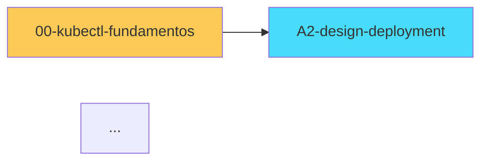

# /ckad-graph — Generar wikilink graph

## Argumento

- **$ARGUMENTS** (opcional): `--scope all|domain-X|sub-dominio`.

## Pasos

1. `Glob` para listar archivos del scope.
2. `grep -rohE "\[\[[a-zA-Z0-9_.-]+(\|[^]]+)?\]\]" --include="*.md"` y extraer pares (source, target).
3. Construir mermaid `graph LR` o `flowchart LR`:
   - Nodos: archivos `.md` atómicos.
   - Edges: cada wikilink.
   - Color/style por dominio (00, A, B, C, D, E).
4. Detectar y resaltar:
   - **Hubs** (>10 in-degree): nodos con muchos referenciantes.
   - **Orphans** (0 in-degree): nodos sin referencias entrantes.
   - **Sinks** (0 out-degree): nodos sin referencias salientes.
5. Escribir `00-Aggregations/wikilink-graph-<scope>.md` con el mermaid + leyenda + métricas.

## Output

```markdown
# 🕸️ Wikilink graph — <scope>



## Métricas
- Total nodos: N
- Total edges: N
- Hubs (>10 in-degree): [lista]
- Orphans (0 in-degree): [lista]
- Sinks (0 out-degree): [lista]

## Recomendaciones
- Connecting orphans: ...
- Hub overload: ...
```

## Reglas

- Si scope >40 archivos, el mermaid puede explotar — split en sub-graphs por sub-dominio.
- Solo análisis local, sin WebFetch.

$ARGUMENTS
